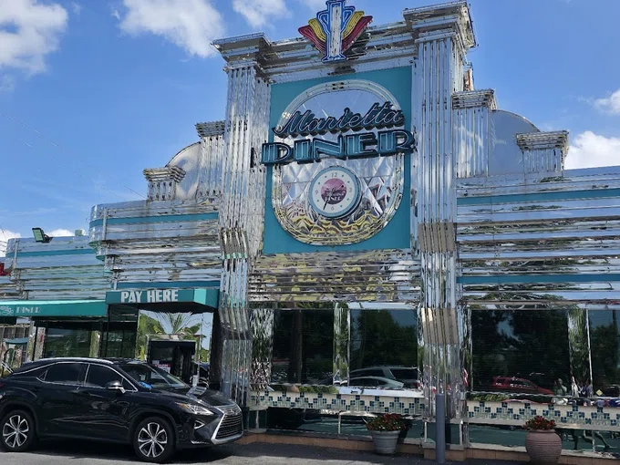
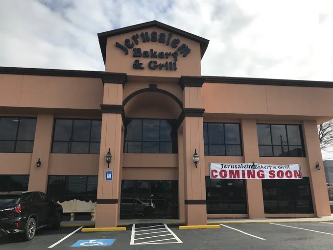
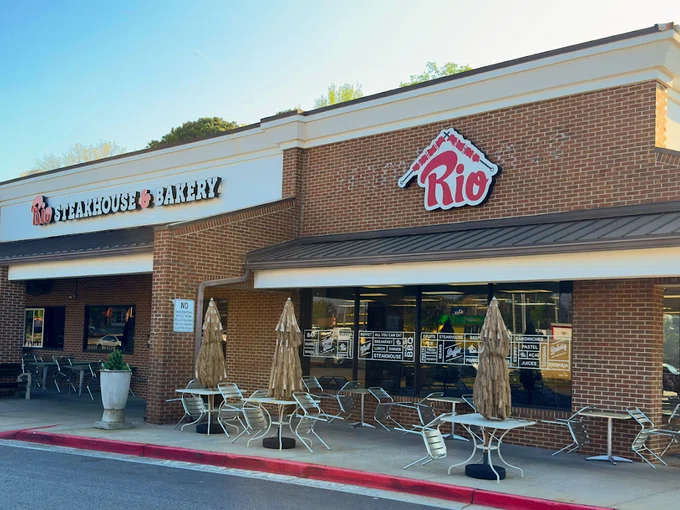
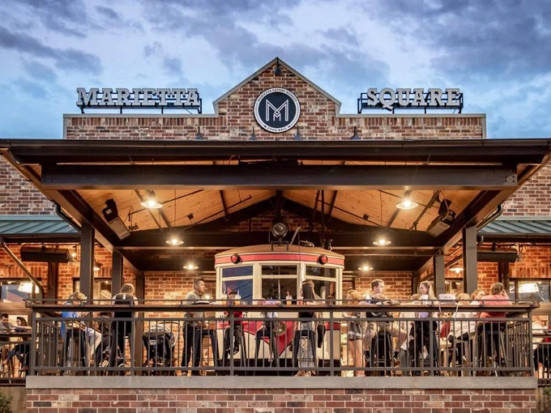
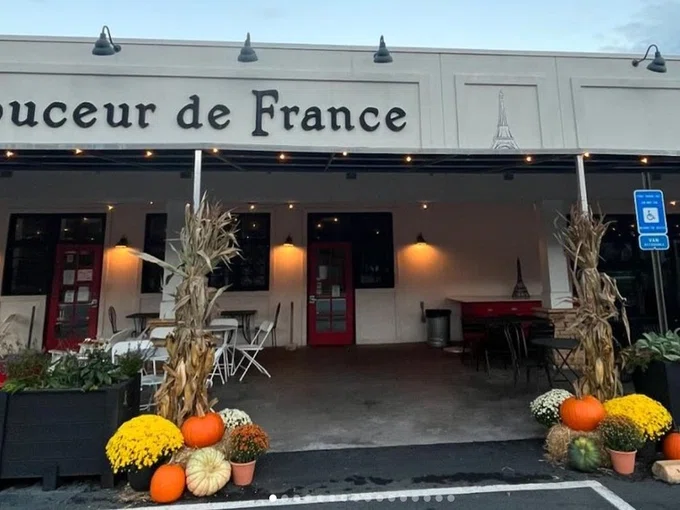
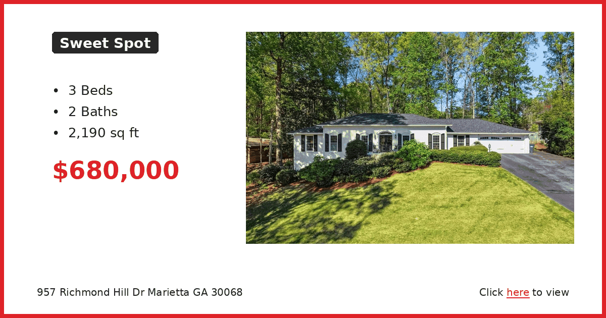
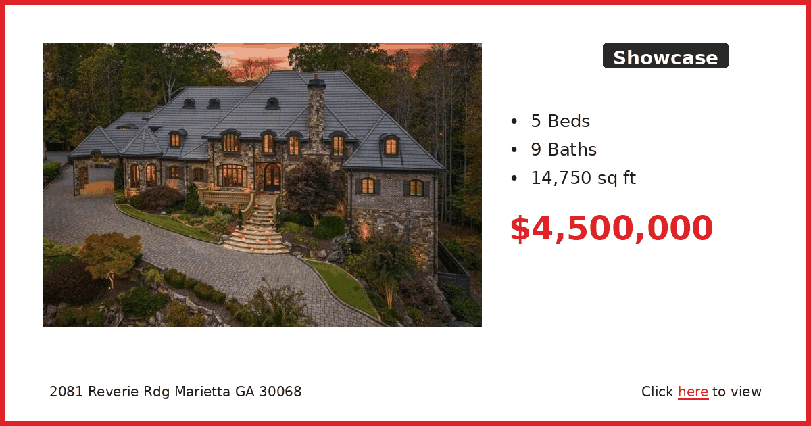

# 🗞️ East Cobb Connect — Week of April 12, 2026

*Auto-generated newsletter content for East Cobb, GA*

---

## 🐾 Furry Friends

**Unknown**

Beignet is getting a second chance, and she's making the most of it. She was adopted from Good Mews as a kitten, ended up scared and alone at a county shelter somehow, and now she's back where she started. Sometimes life just works out that way.

She spent some time in foster care getting her confidence back, and it worked. She loves being petted and turns into a social butterfly at mealtime. When she wants attention, she'll sit close or lean right up against you. She can give gentle love bites when she gets a little overstimulated, so you'll want to watch for her signals and give her space when she needs it.

Beignet knows what it's like to lose a home, so she's going to appreciate whoever gives her the next one. She just needs someone who understands that cats have their limits and respects them. If that sounds like you, she's ready to try again.

Good Mews is a no-kill, cage-free shelter on Robinson Road in Marietta. You'll need to submit an inquiry and visit in person to meet Beignet. Call or email to get the process started.

**Good Mews Animal Foundation**
3805 Robinson Road, Marietta, GA 30067
(770) 499-2287 | adopt@goodmews.org

---

## 🍽️ Restaurant Radar

**Marietta Diner** | American

This is the place you go when you can't decide what you want to eat because they literally have everything. The menu is massive and they're open 24 hours, which makes it perfect for late-night cravings or early breakfast meetings. My family ends up here after youth sports games because the kids can get pancakes while I get a Greek omelet.

The breakfast is what they're known for, but don't sleep on the Greek specialties. The portions are generous and the prices are reasonable for what you get. It's classic diner food done right, and the neon sign makes it easy to spot from Cobb Parkway.

Just be prepared for a wait during weekend breakfast hours. The parking lot fills up fast, but the turnover is pretty quick.

📍 306 Cobb Pkwy SE, Marietta, GA 30060, USA | ⭐ 4.5

---

**Jerusalem Bakery & Grill** | Middle Eastern

This is where we go when we want Middle Eastern food that doesn't break the bank. The atmosphere is casual and the staff is friendly, which makes it perfect for bringing kids who might be trying falafel for the first time. It's tucked into a strip mall but don't let that fool you.

The shawarma is really good and they have solid vegetarian options if you're dealing with picky eaters. The falafel is crispy and not dry like some places, and they have baklava and other desserts that are worth saving room for. Portions are generous so you'll probably have leftovers.

The lunch crowd can get busy around noon, but they move people through pretty efficiently.

📍 1175 Franklin Gateway SE, Marietta, GA 30067, USA | ⭐ 4.6

---

**Rio Steakhouse & Bakery** | Brazilian

If you've never done Brazilian all-you-can-eat barbecue, this is a good place to try it without the downtown Atlanta prices. They bring different cuts of meat to your table and you just say yes or no. The atmosphere is relaxed so you don't feel rushed, which is good because you want time to pace yourself.

The cheese bread alone is worth the trip, and the feijoada stew is authentic if you want to try something traditional. They also do breakfast, which is unusual for this type of place. My wife likes that they have a good salad bar to balance out all the meat.

Come hungry because you're paying for the all-you-can-eat experience. It's in Powers Ferry Plaza so parking is easy.

📍 1275 Powers Ferry Rd ste 230, Marietta, GA 30067, USA | ⭐ 4.6

---

**Marietta Square Market** | Food Hall

This is perfect when your group can't agree on one type of food because there are twenty different options under one roof. It's right near the Marietta Square so you can walk around afterward, and the setup makes it easy for families with different preferences. Everyone orders what they want and meets back at a table.

The variety is impressive and the quality is generally good across the different vendors. I've had everything from tacos to Asian fusion to desserts here. It's also good for a quick lunch if you work nearby because you have options beyond the usual chain restaurants.

Parking can be tight during peak hours, but there are several lots around the square if you don't mind a short walk.

📍 68 North Marietta Pkwy NW, Marietta, GA 30060, USA | ⭐ 4.6

---

**Douceur De France - Bakery & Brunch** | French Bakery

This is the real deal for French pastries and breakfast items. The baguettes are exactly what you'd expect from a proper French bakery, and the petits fours are perfect if you need something fancy for a meeting or small gathering. The atmosphere is bright and welcoming, not intimidating like some French places can be.

The quiches are excellent for brunch and they have croissants that actually taste like they're made with real butter. My wife gets the pain au chocolat whenever we're here. Everything is made fresh and you can tell the difference.

It's popular so weekend mornings can get busy, but the line moves pretty quickly. They also sell some retail items if you want to take home bread or pastries.

📍 277 South Marietta Pkwy SW, Marietta, GA 30064, USA | ⭐ 4.9

---

---

## 🗞️ Local Lowdown

---

## 🏠 Real Estate Corner

### 🏠 Starter: 5/4 with 4,200 sq ft for $300k in Westbury

This is the kind of listing that makes you do a double-take — five bedrooms and four baths for under $300k in East Cobb. The square footage alone makes this a steal if you need space and don't mind putting in some work.

[View Listing →](https://www.realtor.com/realestateandhomes-detail/1846-Westbury-Ln-SW_Marietta_GA_30064_M54598-04844)

---

### 🏡 Sweet Spot: 3/2 ranch on Richmond Hill Drive

This spot puts you right in the heart of East Cobb near Eastside Elementary and Pope High School. At $680k for a well-maintained ranch with a nice lot, it's priced at the top of the sweet spot but you're paying for the location and school district access.

[View Listing →](https://www.realtor.com/realestateandhomes-detail/957-Richmond-Hill-Dr_Marietta_GA_30068_M63429-77416)

---

### 🏰 Showcase: Nearly 15,000 sq ft estate on Reverie Ridge

When people talk about East Cobb luxury, this is what they mean — $4.5 million gets you a mansion with nine bathrooms and enough space to host half the neighborhood. This is serious money for serious space in one of the area's most exclusive pockets.

[View Listing →](https://www.realtor.com/realestateandhomes-detail/2081-Reverie-Rdg_Marietta_GA_30068_M53196-53229)

---

---

*Generated on April 12, 2026 by [Newsletter Automation](https://github.com/couch2coders/NewsletterAutomation)*
