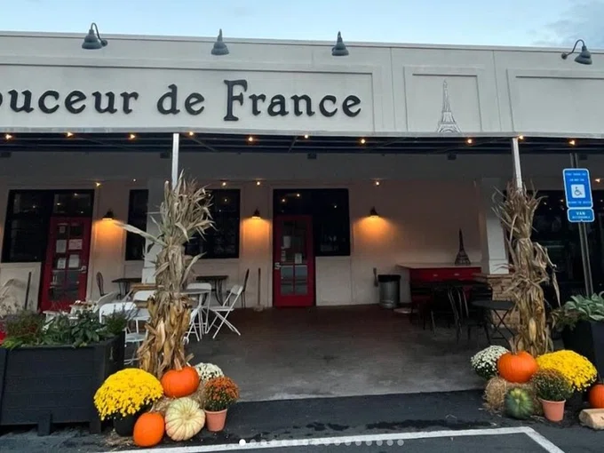
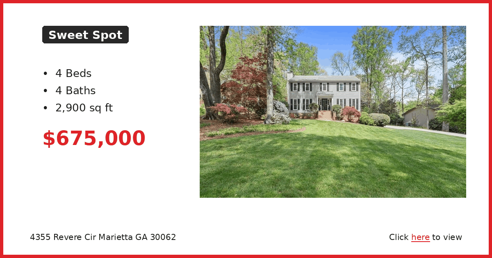
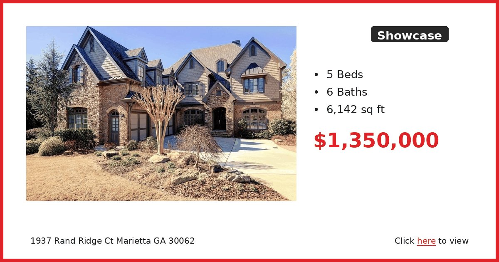

# 🗞️ East Cobb Connect — Week of April 13, 2026

*Auto-generated newsletter content for East Cobb, GA*

---

## 🐾 Furry Friends

**Tiny**

Don't let the name fool you. Tiny is small, but she's got the curiosity of a cat twice her size. She showed up at Good Mews from a county shelter looking for a better shot at finding someone who'd appreciate her gentle, playful energy. She's the kind of cat who'll investigate every corner of your house, chase toys around when the mood strikes, and then settle in somewhere cozy to watch the world go by.

She's got that perfect mix of wanting to explore everything and knowing when it's time to just be chill. If you're looking for a companion who's engaged but not overwhelming, she might be exactly what you're after. She's small enough that she won't take over your space, but big enough in personality that you'll definitely know she's there.

Good Mews is a no-kill, cage-free shelter on Robinson Road in Marietta. You'll need to submit an inquiry and visit in person to meet Tiny. Call or email to get the process started.

**Good Mews Animal Foundation**
3805 Robinson Road, Marietta, GA 30067
(770) 499-2287 | adopt@goodmews.org

[Meet Tiny →](https://www.petfinder.com/cat/tiny-3336dacb-f78b-44ff-bef1-f938241bb955/ga/marietta/good-mews-animal-foundation-ga173/details/)

---

## 🍽️ Restaurant Radar

**Marietta Diner** | American Restaurant

This is the diner that never closes and somehow always has exactly what you're craving. I've been here at 2am after a night out and at 7am before a flight, and it hits the same every time. The neon sign is a Marietta landmark at this point.

The menu is absolutely massive - like phone book thick - with everything from Greek gyros to massive breakfast platters. My go-to is the Greek omelet because they do the Greek specialties really well, but my kids always get the pancakes which are huge. The portions are generous and the prices are still reasonable for what you get.

Just know it gets packed on weekend mornings and after church on Sundays. But since they're open 24/7, you can always come back when it's quieter.

📍 306 Cobb Pkwy SE, Marietta, GA 30060, USA | ⭐ 4.5

---

**Jerusalem Bakery & Grill** | Middle Eastern Restaurant

This is my go-to when I want Middle Eastern food that's fresh and doesn't break the bank. It's in a strip mall but don't let that fool you - the food is legit and the portions are huge. Perfect for lunch or when you want something different from the usual chain restaurants.

The shawarma is what most people order and it's really good - they pile it high with all the fixings. The falafel is crispy and not dry like some places. My wife always gets the veggie combo plate because they have good options that aren't just an afterthought. The desserts are worth trying too if you have room.

📍 1175 Franklin Gateway SE, Marietta, GA 30067, USA | ⭐ 4.6

---

**Rio Steakhouse & Bakery** | Brazilian Restaurant

This is where we go when we want to eat way too much meat and feel good about it. It's Brazilian all-you-can-eat barbecue, so come hungry and wear stretchy pants. Great for celebrations or when you have out-of-town guests who want to experience something different.

They bring endless skewers of different cuts right to your table, and the cheese bread alone is worth the trip. The feijoada stew is really good if you want something beyond just meat. They also do breakfast which is a nice touch - not many places around here do Brazilian breakfast.

Just know it's not cheap, but you definitely get your money's worth if you're actually hungry. Not the place for a light lunch.

📍 1275 Powers Ferry Rd ste 230, Marietta, GA 30067, USA | ⭐ 4.6

---

**Marietta Square Market** | Restaurant

This is basically our local food court but way better than mall food. Twenty different vendors all in one spot right on the square, so everyone in the family can get what they actually want. Good for when you can't agree on where to eat or want to try a few different things.

The variety is impressive - everything from tacos to ramen to barbecue. I usually end up getting something different every time because there are so many options. The kids like that they can see everything being made and choose exactly what looks good to them.

Parking can be tricky on busy nights since it's right downtown, but it's worth walking a block or two. Great spot before or after events on the square.

📍 68 North Marietta Pkwy NW, Marietta, GA 30060, USA | ⭐ 4.6

---

**Douceur De France - Bakery & Brunch** | Bakery

This is the real deal French bakery that makes everything from scratch. I come here for special occasions or when I want to pretend I'm more sophisticated than I actually am. The croissants are buttery and flaky like they should be, and the quiches make a great lunch.

The baguettes are perfect if you're having people over for dinner, and the petit fours are beautiful if you need dessert for a party. My wife loves the brunch options - they do French toast and other breakfast items that feel special without being too fussy.

Just know they run out of popular items by afternoon, so go early if you want the best selection. It's pricier than regular bakeries but worth it for the quality.

📍 277 South Marietta Pkwy SW, Marietta, GA 30064, USA | ⭐ 4.9

---

---

## 🗞️ Local Lowdown

### 🏥 Northside East Cobb Medical Center sells for $32.5 million

The Northside East Cobb Medical Center on Johnson Ferry Road has been sold for **$32.5 million**, marking a significant transaction in the local healthcare market.

The sale could impact patient services and staffing at the facility that serves thousands of East Cobb families. Details about the new ownership and any planned changes to operations have not yet been announced.

More: East Cobb News

More: [East Cobb News](https://eastcobbnews.com/northside-east-cobb-medical-center-sold-for-32-5-million/)

### 🛒 East Cobb retail center getting major makeover

An older East Cobb retail center is undergoing a significant renovation that could bring new businesses and improved shopping options to the area.

The makeover represents fresh investment in East Cobb's retail landscape and could create new job opportunities and dining options for residents.

More: East Cobb News

More: [East Cobb News](https://eastcobbnews.com/editors-note-a-makeover-for-an-old-east-cobb-retail-center/)

---

## 🏠 Real Estate Corner

### 🏠 Starter: 5/4 with 4,220 sqft for $300k on Westbury

You don't see numbers like this often in East Cobb. Five bedrooms and four full baths for under $325k means there's probably some work needed, but the bones are solid. At this price per square foot, it's worth a look for anyone willing to put in some sweat equity.

[View Listing →](https://www.realtor.com/realestateandhomes-detail/1846-Westbury-Ln-SW_Marietta_GA_30064_M54598-04844)

---

### 🏡 Sweet Spot: 4/4 on Revere Circle near East Cobb Middle

This hits the sweet spot for families wanting East Cobb schools without stretching to $800k. Four bedrooms with a bathroom for each, plus you're walking distance to East Cobb Middle. The neighborhood's established with mature trees and sidewalks.

[View Listing →](https://www.realtor.com/realestateandhomes-detail/4355-Revere-Cir_Marietta_GA_30062_M52329-54457)

---

### 🏰 Showcase: 6,100+ sqft on Rand Ridge Court

This is what $1.35M gets you in prime East Cobb right now. Six bathrooms means no morning rush hour fights, and 6,000+ square feet gives everyone their space. The address puts you in the heart of the East Cobb school district with quick access to 75.

[View Listing →](https://www.realtor.com/realestateandhomes-detail/1937-Rand-Ridge-Ct_Marietta_GA_30062_M50228-52741)

---

---

*Generated on April 13, 2026 by [Newsletter Automation](https://github.com/couch2coders/NewsletterAutomation)*
