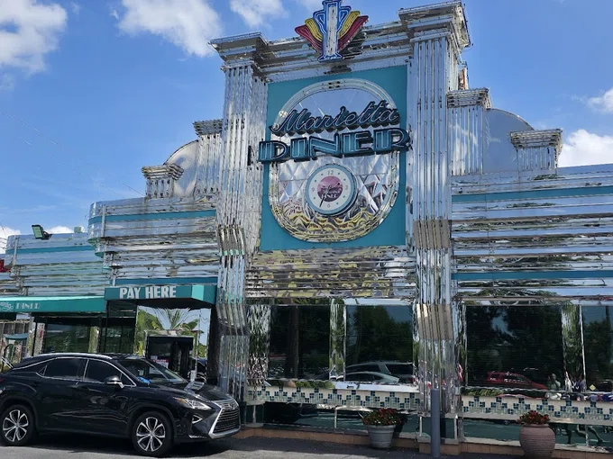
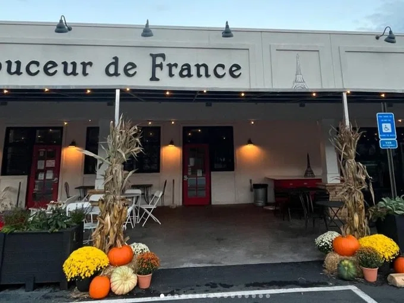
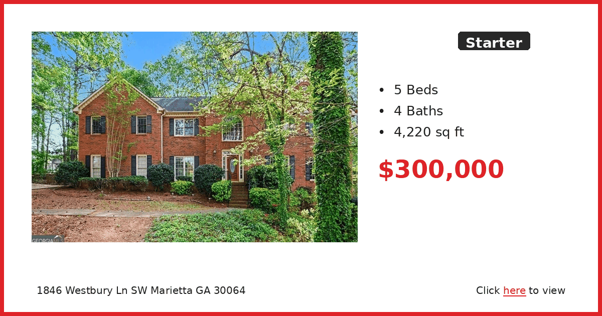
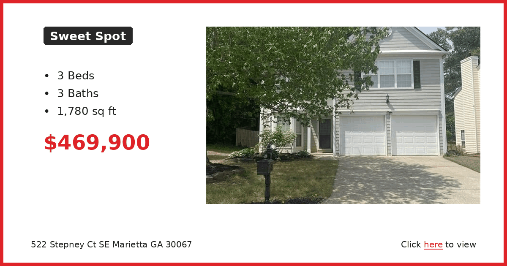
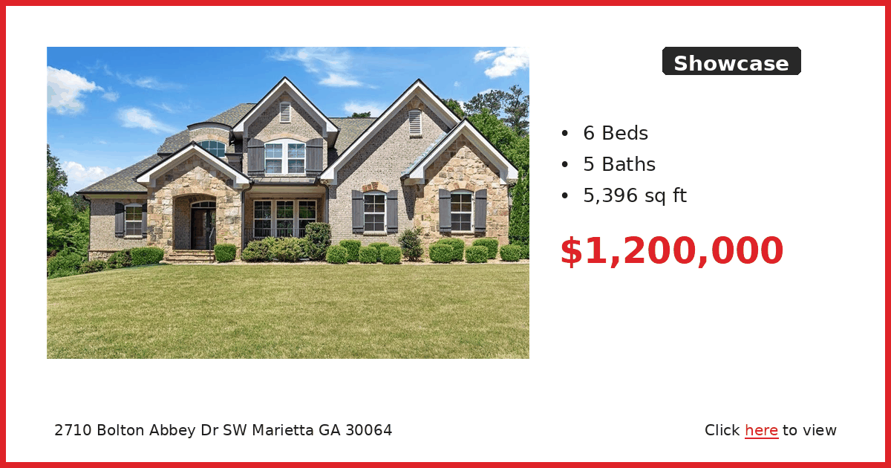

# 🗞️ East Cobb Connect — Week of April 20, 2026

*Auto-generated newsletter content for East Cobb, GA*

---

## 🐾 Furry Friends

**Unknown**

Otis was so stressed at the county shelter that he was peeing on himself. Not because he's not housetrained—because he was terrified. The moment they got him into a quiet room, he buried his head in someone's lap and wouldn't let go. That's all he needed. Just out of there.

Now he's at Our Pal's Place and he's a completely different dog. Tail wagging, sitting politely, remembering all his manners. He loves attention and wants nothing more than to make his people happy. The stress made him forget who he was for a while, but it all came back once he felt safe again.

Whoever gets Otis is going to have a loyal, grateful companion who knows what it's like to almost lose everything. He's not going to take a good home for granted.

Our Pal's Place is on Canton Road in Marietta. Call or email to start the adoption process and meet Otis in person.

**Our Pal's Place**
4508 Canton Road, Marietta, GA 30062
(678) 361-7623 | helpanimals@ourpalsplace.org

---

## 🍽️ Restaurant Radar

**Marietta Diner** | American Restaurant

This is the kind of place that saves you when nothing else is open and you need real food at 2am. The neon sign has been a Cobb Parkway landmark forever, and inside it's exactly what you'd expect from a classic diner. Perfect for late-night cravings, early breakfast meetings, or when the kids want pancakes at dinner time.

The menu is massive and covers everything from standard diner fare to Greek specialties like gyros and moussaka. Their breakfast is huge and available around the clock, which is why shift workers and insomniacs love this place. The portions are generous and the coffee keeps coming.

Being open 24/7 makes it a lifesaver, especially if you're coming home late from the airport or need somewhere to meet at odd hours.

📍 306 Cobb Pkwy SE, Marietta, GA 30060, USA | ⭐ 4.5

---

**Jerusalem Bakery & Grill** | Middle Eastern Restaurant

We stumbled on this place a few years ago and it's become our go-to for Middle Eastern food in East Cobb. It's casual and family-friendly, tucked into a shopping center but with really solid food. Great option when you want something different but not too adventurous.

The shawarma is what most people order and it's consistently good. My wife loves their falafel, and they have plenty of veggie options if that's your thing. The portions are generous and everything comes with their homemade pita. Save room for the baklava if you're eating in.

They're pretty accommodating if you have dietary restrictions, and the staff is always happy to explain what's in each dish.

📍 1175 Franklin Gateway SE, Marietta, GA 30067, USA | ⭐ 4.6

---

**Rio Steakhouse & Bakery** | Brazilian Restaurant

If you've never done Brazilian barbecue, this is a good place to try it without the intimidation factor of some of the fancier churrascarias in town. It's all-you-can-eat with servers bringing different grilled meats to your table, but the atmosphere is relaxed and family-friendly. Perfect for special occasions or when you want to try something new.

The cheese bread alone is worth the trip, and the feijoada stew is authentic if you're feeling adventurous. They keep bringing different cuts of meat until you flip your little card to stop them. Even picky eaters can find something they like since there's also a salad bar.

They also serve breakfast, which is unusual for this type of place and makes it a good weekend brunch spot if you want something different from the usual pancake places.

📍 1275 Powers Ferry Rd ste 230, Marietta, GA 30067, USA | ⭐ 4.6

---

**Marietta Square Market** | Restaurant

This food hall downtown is perfect when your group can't agree on what to eat. Twenty different vendors under one roof means everyone can get what they want and still sit together. It's become our default for family dinners when the kids are being picky.

The variety is impressive and changes periodically as vendors rotate in and out. You can get everything from tacos to sushi to barbecue, plus there are usually a few dessert options. The quality varies by vendor, but most are solid local businesses rather than chains.

Parking can be tricky during busy weekend evenings, but it's worth the hassle for the convenience of having so many options in one spot.

📍 68 North Marietta Pkwy NW, Marietta, GA 30060, USA | ⭐ 4.6

---

**Douceur De France - Bakery & Brunch** | Bakery

This little French bakery is the real deal and has become our Saturday morning ritual. The owner is French and everything tastes authentic, from the croissants to the quiches. It's bright and cheerful inside, perfect for a leisurely weekend brunch or grabbing pastries for the office.

Their baguettes are crusty and perfect, and the petits fours are almost too pretty to eat. The quiche changes daily and is always good for a light lunch. If you're having people over, their pastries make you look like you know what you're doing even if you can barely boil water.

Get there early on weekends because the good stuff sells out, especially the croissants. They also do custom cakes if you need something special for a birthday or celebration.

📍 277 South Marietta Pkwy SW, Marietta, GA 30064, USA | ⭐ 4.9

---

---

## 🗞️ Local Lowdown

---

## 🏠 Real Estate Corner

### 🏠 Starter: 5BR/4BA for $300k? Yes, really

This Westbury Lane house is the kind of deal that makes you double-check the listing. You're getting over 4,000 square feet for under $300k, which is practically unheard of in this market. It's going to need some work, but for a big family needing space without the big price tag, this is your unicorn.

[View Listing →](https://www.realtor.com/realestateandhomes-detail/1846-Westbury-Ln-SW_Marietta_GA_30064_M54598-04844)

---

### 🏡 Sweet Spot: Updated 3BR in East Cobb school zone

This Stepney Court townhome hits the sweet spot for families wanting East Cobb schools without the East Cobb price tag. Three full baths means no more morning bathroom battles, and at 1,780 square feet, you've got room to breathe. The location puts you close to everything but keeps you in a quiet cul-de-sac.

[View Listing →](https://www.realtor.com/realestateandhomes-detail/522-Stepney-Ct-SE_Marietta_GA_30067_M69505-25299)

---

### 🏰 Showcase: 6BR estate with room for everything

This Bolton Abbey drive home is what happens when you don't have to compromise. Six bedrooms and five baths spread across 5,400 square feet means everyone gets their space, plus room for the home office, gym, and whatever else is on your wish list. At $1.2M, you're paying for the space and the address.

[View Listing →](https://www.realtor.com/realestateandhomes-detail/2710-Bolton-Abbey-Dr-SW_Marietta_GA_30064_M64201-27884)

---

---

*Generated on April 20, 2026 by [Newsletter Automation](https://github.com/couch2coders/NewsletterAutomation)*
