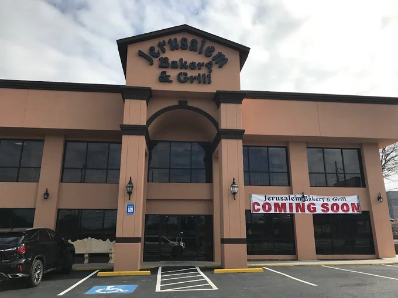

# 🗞️ East Cobb Connect — Week of April 12, 2026

*Auto-generated newsletter content for East Cobb, GA*

---

## 🐾 Furry Friends

**Unknown**

Luke's story started rough. His mom Miss Daisy ended up at the county shelter with her two puppies after their owner passed away and nobody in the family stepped up to help. But once Luke got to Our Pal's Place, he turned into the fun-loving, playful boy he was meant to be. The summer camp kids at the rescue gave him tons of attention and walks on the trails, and he soaked it all up.

He's got the face of a Belgian Malinois but he's smaller than most shepherds, which means you get all that smart, loyal shepherd personality in a more manageable package. Luke is young and energetic, so he's going to need someone who can keep up with him and give him things to do. Shepherds are happiest when they have a job, even if that job is just being your hiking buddy or learning new tricks.

If you've been thinking about a shepherd but worried about size or intensity, Luke might be exactly what you're looking for. He's ready to be someone's loyal companion and best friend. Our Pal's Place is on Canton Road in Marietta. Call ahead to meet him.

**Our Pal's Place**
4508 Canton Road, Marietta, GA 30062
(678) 361-7623 | helpanimals@ourpalsplace.org

[Meet Unknown →]()

---

## 🍽️ Restaurant Radar

**Marietta Diner** | American

This is the kind of place that feels like it's been here forever, and honestly, it probably has. It's one of those classic diners with the neon sign out front and booths that have seen decades of late-night conversations. Open 24 hours, so whether you're coming off a late shift or need pancakes at 2am, they've got you covered. The menu is huge and includes Greek dishes alongside all the diner classics. I usually go for the big breakfast platters, but my wife likes their Greek specialties when she's in the mood for something different. It's perfect for those times when you want comfort food and don't want to think too hard about it.

📍 306 Cobb Pkwy SE, Marietta, GA 30060, USA | ⭐ 4.5

---

**Jerusalem Bakery & Grill** | Middle Eastern

If you haven't tried Middle Eastern food or think it's all weird and spicy, this is your gateway place. The atmosphere is super casual and the staff is patient with questions about what everything is. I always get the shawarma because it's basically the perfect sandwich, and my kids love the falafel even though they're picky about everything else. They have good vegetarian options too if that's your thing. The portions are generous and the prices won't hurt your wallet. Great for a quick lunch or when you want something different from the usual chicken and burgers routine.

📍 1175 Franklin Gateway SE, Marietta, GA 30067, USA | ⭐ 4.6

---

**Rio Steakhouse & Bakery** | Brazilian

This is Brazilian barbecue done right, where they bring different cuts of meat to your table until you surrender. It's all-you-can-eat, so come hungry and wear stretchy pants. The cheese bread alone is worth the trip, and they also serve feijoada stew if you want to try Brazil's national dish. The vibe is relaxed, not stuffy like some steakhouses, so it works for families or a date night when you want to try something different. They also do breakfast, which is pretty unique around here. Just pace yourself because there's a lot of good food coming your way.

📍 1275 Powers Ferry Rd ste 230, Marietta, GA 30067, USA | ⭐ 4.6

---

**Marietta Square Market** | Food Hall

This is perfect when your family can't agree on what to eat because there are twenty different restaurants all under one roof. It's like a grown-up food court but with actually good food. Everyone can get what they want and still sit together. My kids love having options, and I appreciate that I can get real food instead of just mall fare. The setup works great for quick lunches downtown or when you're exploring the square with visitors. It's also nice that you can grab retail stuff while you're there. Just know it can get busy during lunch hours on weekdays.

📍 68 North Marietta Pkwy NW, Marietta, GA 30060, USA | ⭐ 4.6

---

**Douceur De France - Bakery & Brunch** | French Bakery

This place makes me feel like I'm cheating on every other bakery in town. The French baked goods are legit, not the grocery store pastry case stuff you're used to. Their baguettes are what French bread is supposed to taste like, and the petits fours are perfect for when you need something fancy for a meeting or party. I go for the quiches when I want actual brunch, not just sweet stuff. It's bright and cheerful inside, good for meeting friends or grabbing something special for weekend breakfast. Just don't expect American-style huge portions. This is quality over quantity, and honestly, that's refreshing sometimes.

📍 277 South Marietta Pkwy SW, Marietta, GA 30064, USA | ⭐ 4.9

---

---

## 🗞️ Local Lowdown

### 💳 Cobb commissioners to vote on new financial chief

The Cobb County Board of Commissioners will consider appointing a new chief financial officer at next week's meeting. The CFO position oversees the county's annual budget of more than **$1.8 billion** and manages financial operations for services that affect every East Cobb resident.

The appointment requires a majority vote by commissioners and will set financial leadership for the county through major upcoming projects and budget cycles.

More: [MDJ](https://mdjonline.com/news/local/cobb-to-vote-on-new-chief-financial-officer/article_5d36c5a9-93b6-4f3a-8447-b91b955160c8.html)

### 🚰 Sewage spill reported near East Cobb area

Cobb County Water System reported a **150-gallon** wastewater overflow that occurred on **April 4**. The spill was contained and cleaned up according to environmental regulations.

While relatively small, any sewage overflow can affect local waterways and requires monitoring. The county water system serves most East Cobb neighborhoods and handles these incidents under state environmental guidelines.

More: [MDJ](https://www.mdjonline.com/news/cobb-county-water-system-reports-150-gallon-sewage-overflow/article_8b1ee9ec-3407-4713-aa5a-d7d6fff74e5d.html)

---

## 🏠 Real Estate Corner

### 🏠 Starter: 5/4 with 4,220 square feet for $300k

This Westbury Lane house is basically a unicorn at this price point. You're getting over 4,000 square feet and five bedrooms for what most people pay for a three-bedroom ranch around here. Something's probably going on with condition or layout, but if you can handle a project, this is serious square footage value.

[View Listing →](https://www.realtor.com/realestateandhomes-detail/1846-Westbury-Ln-SW_Marietta_GA_30064_M54598-04844)

---

### 🏡 Sweet Spot: Brand new 5/5 in Laurel Springs for $650k

Five bedrooms and five full baths in under 3,000 square feet means someone designed this smart. It's new construction in a solid East Cobb pocket, and $650k still gets you into good school zones without stretching into the $800k range that's becoming normal around here.

[View Listing →](https://www.realtor.com/realestateandhomes-detail/950-Laurel-Springs-Ln-SW_Marietta_GA_30064_M58222-95742)

---

### 🏰 Showcase: Nearly 15,000 square feet on Reverie Ridge

$4.5 million gets you a compound-sized house with nine bathrooms and almost 15,000 square feet. This is the kind of place where you need a map to find the guest bedrooms. It's priced for someone who wants to own their own private resort in East Cobb.

[View Listing →](https://www.realtor.com/realestateandhomes-detail/2081-Reverie-Rdg_Marietta_GA_30068_M53196-53229)

---

---

*Generated on April 12, 2026 by [Newsletter Automation](https://github.com/couch2coders/NewsletterAutomation)*
