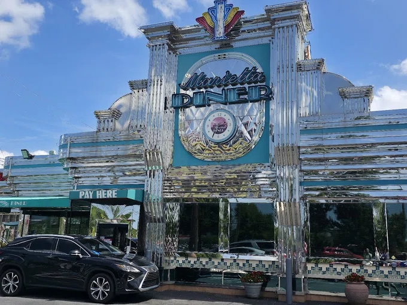
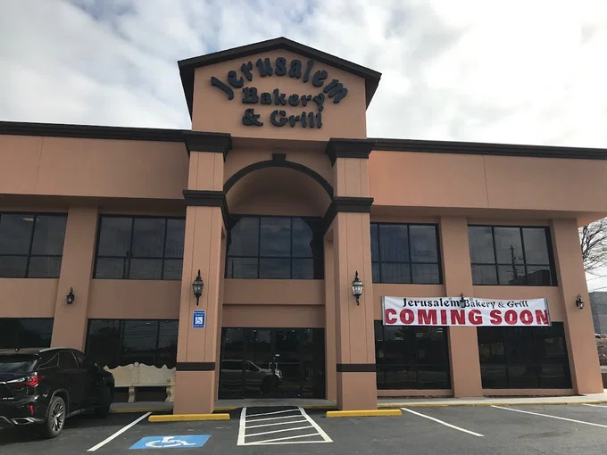
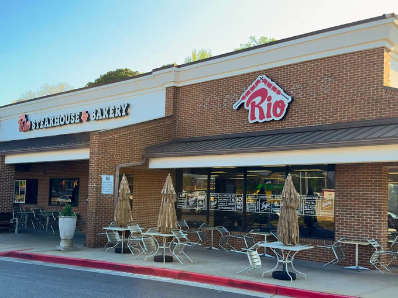
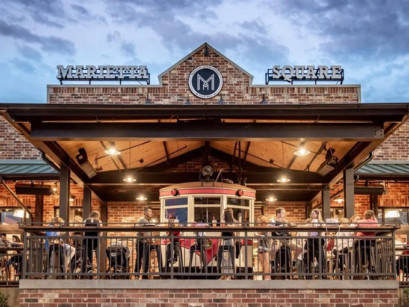
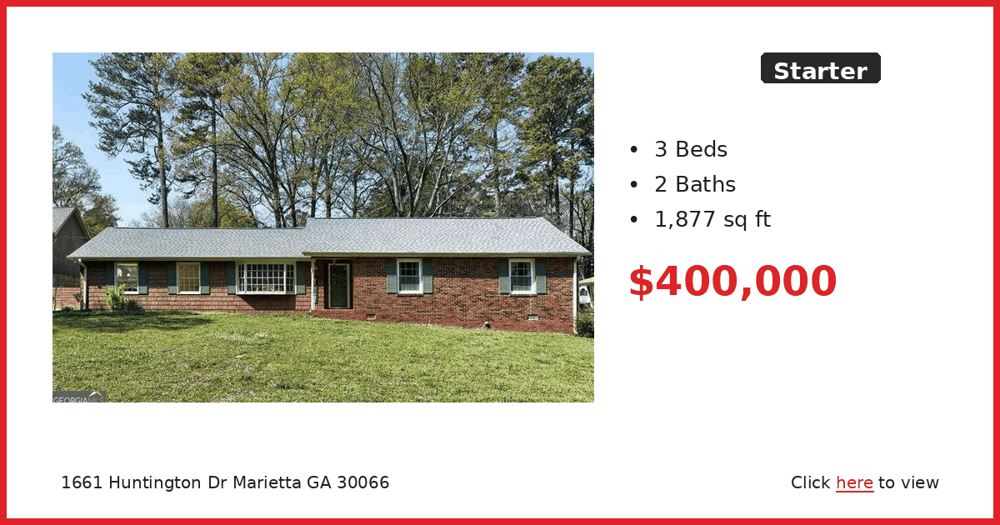
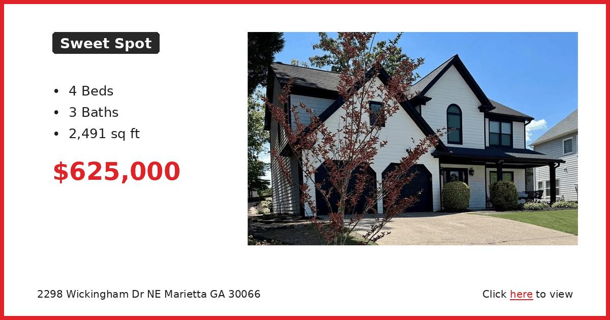
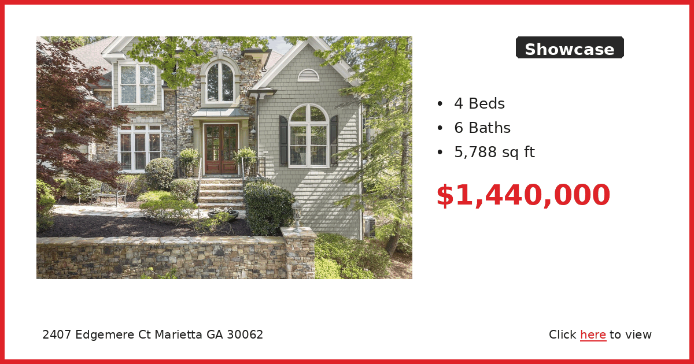

# 🗞️ East Cobb Connect — Week of April 27, 2026

*Auto-generated newsletter content for East Cobb, GA*

---

## 🐾 Furry Friends

**Unknown**

Otis was on the kill list at the county shelter just because of a date on a calendar. Not because he was aggressive or sick or difficult. He was just stressed out of his mind in the chaos and noise, urinating on himself from pure anxiety. The second they got him into a quiet room, he buried his head in someone's lap and didn't want to move.

Now that he's had time to decompress at Our Pal's Place, he's back to being the dog he actually is. House-trained, sits politely, wags his tail, loves attention. He's one of those dogs who just wants to please you. The volunteers say he's fun-loving and loyal, which tracks for a dog who went through that much stress and bounced back this well.

Whoever gets Otis is going to have a companion who knows what it's like to almost lose everything and appreciates having a home. He's not going to take it for granted.

Our Pal's Place is on Canton Road in Marietta. Call or email to get the adoption process started.

---

## 🍽️ Restaurant Radar

**Marietta Diner** | American Restaurant

This is the place when you need food at 2am or want breakfast at dinnertime. The Marietta Diner has been doing the 24-hour thing forever, and honestly, it's kind of comforting to know it's always there. The menu is massive and they do Greek stuff alongside the usual diner fare, which makes sense once you realize the owners are Greek. My go-to is the breakfast platter because they don't mess around with portion sizes. The pancakes are huge and the hash browns are crispy. If you're feeling fancy, try the gyro or one of the Greek specialties. It's not gourmet, but it hits the spot when you want comfort food that won't break the bank.

📍 306 Cobb Pkwy SE, Marietta, GA 30060, USA | ⭐ 4.5

---

**Jerusalem Bakery & Grill** | Middle Eastern Restaurant

This is where we go when we want Middle Eastern food but don't want to deal with the crowds at some of the bigger places. It's tucked into Franklin Gateway and the vibe is super chill. Perfect for a casual lunch or dinner when you want something healthy but filling. The shawarma is really good and they pile it high. My wife always gets the falafel platter and loves that they have plenty of veggie options. The hummus is creamy and they give you warm pita bread. Don't skip the desserts if you have room - the baklava is legit. It's the kind of place where the owner might come chat with you about the food.

📍 1175 Franklin Gateway SE, Marietta, GA 30067, USA | ⭐ 4.6

---

**Rio Steakhouse & Bakery** | Steak House

If you've never done the Brazilian steakhouse thing, this is a good place to start. They bring the meat to your table on skewers and you eat until you can't move. It's all-you-can-eat so pace yourself. The cheese bread alone is worth the trip - it's addictive and they keep bringing it. My family loves the variety of cuts they offer and the salad bar is actually pretty decent too. They do breakfast and have feijoada stew if you want to try something traditional. It's not cheap but you definitely get your money's worth. Good for celebrations or when you want to impress someone who hasn't experienced the Brazilian barbecue experience.

📍 1275 Powers Ferry Rd ste 230, Marietta, GA 30067, USA | ⭐ 4.6

---

**Marietta Square Market** | Restaurant

This is basically a fancy food court but way better than the mall version. Twenty different vendors under one roof means everyone in your group can get something different. Perfect when you can't agree on what kind of food you want. I like that you can get everything from tacos to Asian food to barbecue all in one place. The kids can get pizza while the adults try something more adventurous. It's right by the square so you can walk around downtown after you eat. Gets busy on weekends but that just means the food is fresh since there's good turnover. Way more interesting than chain restaurants and you're supporting local businesses.

📍 68 North Marietta Pkwy NW, Marietta, GA 30060, USA | ⭐ 4.6

---

**Douceur De France - Bakery & Brunch** | Bakery

This place makes me feel like I'm back in France, which is saying something because I'm picky about French pastries. The owner is actually French and you can tell in everything they make. The croissants are flaky and buttery like they should be, and the baguettes have that perfect crust. My wife loves their quiches for a light lunch and the petits fours are beautiful for special occasions. Weekend brunch is popular so get there early or expect a wait. The coffee is good too, which matters when you're having pastry. It's a bright, cheerful spot that makes you want to linger over breakfast. Worth the trip even if you're just grabbing pastries to take home.

📍 277 South Marietta Pkwy SW, Marietta, GA 30064, USA | ⭐ 4.9

---

---

## 🗞️ Local Lowdown

### 🔥 Burn ban now in effect countywide due to drought

Cobb County Fire Marshal has issued a burn ban effective immediately due to drought conditions. All outdoor burning is prohibited until further notice, including yard debris, campfires, and fire pits.

This affects **all of Cobb County** including East Cobb neighborhoods. Violators can face fines and be held liable for any fires that spread to neighboring properties.

More: [East Cobb News](https://eastcobbnews.com/cobb-fire-marshal-issues-burn-ban-due-to-drought-conditions)

### 🐴 East Cobb family has 90 days to relocate emotional support pony

The Cobb County Board of Commissioners unanimously ruled this week that Dark Chocolate, a mini Shetland pony, cannot remain at a subdivision home in East Cobb. The pony serves as an emotional support animal for a young daughter.

The family now has **90 days** to find alternative housing for the pony. The case highlights ongoing debates about emotional support animals in residential neighborhoods.

More: [Marietta Daily Journal](https://mdjonline.com/news/local/east-cobb-man-given-90-days-to-relocate-daughter-s-emotional-support-pony/article_119680d6-19d0-4378-b2b5-d360909cd44c.html)

---

## 🏠 Real Estate Corner

### 🏠 Starter: 3/2 ranch for $400k on Huntington

Nearly 1,900 square feet for exactly $400k is rare in East Cobb these days. This one's in the Tritt Elementary zone and has enough space that you won't feel cramped while you build equity.

[View Listing →](https://www.realtor.com/realestateandhomes-detail/1661-Huntington-Dr_Marietta_GA_30066_M66362-03521)

---

### 🏡 Sweet Spot: 4/3 with 2,500 sqft near East Cobb Middle

This Wickingham home hits the sweet spot for families wanting East Cobb schools without stretching to $700k. Four bedrooms and three full baths means everyone gets their space, and you're walking distance to the middle school.

[View Listing →](https://www.realtor.com/realestateandhomes-detail/2298-Wickingham-Dr-NE_Marietta_GA_30066_M55448-18608)

---

### 🏰 Showcase: 5,800 sqft custom with six baths on Edgemere

Six bathrooms in a four-bedroom house tells you this isn't your average East Cobb build. The Edgemere Court location puts you in the heart of the area's most established neighborhood, and nearly 6,000 square feet means you'll never run out of room to spread out.

[View Listing →](https://www.realtor.com/realestateandhomes-detail/2407-Edgemere-Ct_Marietta_GA_30062_M61827-51534)

---

---

*Generated on April 27, 2026 by [Newsletter Automation](https://github.com/couch2coders/NewsletterAutomation)*
