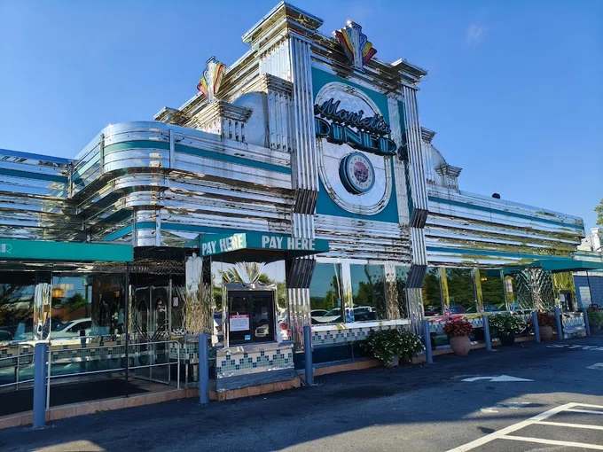
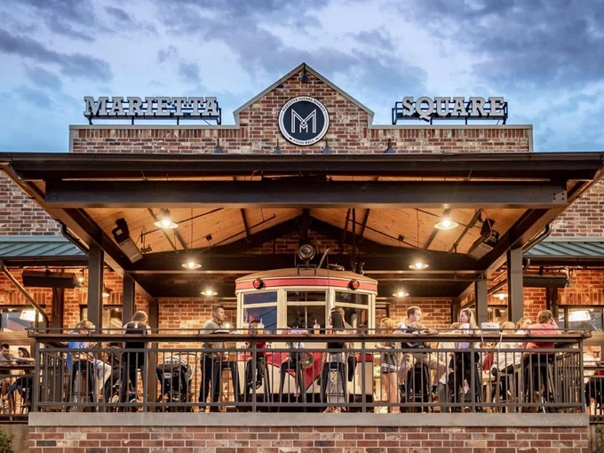
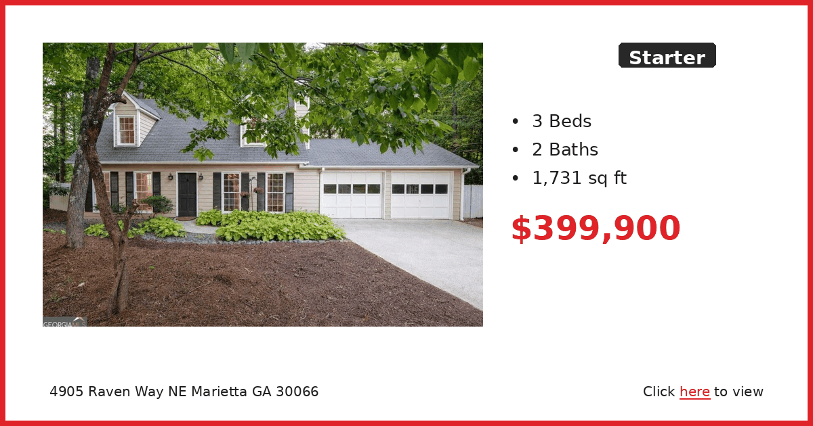
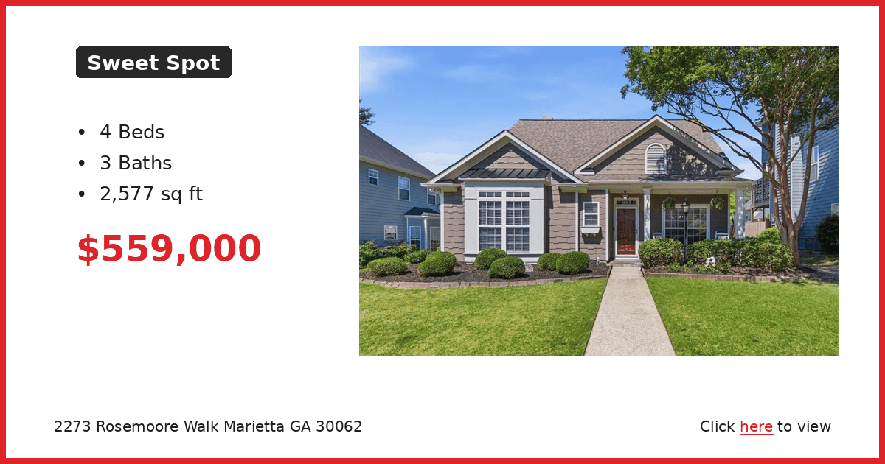

# 🗞️ East Cobb Connect — Week of June 08, 2026

*Auto-generated newsletter content for East Cobb, GA*

---

## 🐾 Furry Friends

**Unknown**

Otis almost didn't make it. He was on the euthanasia list at the county shelter just because his number came up, not because there was anything wrong with him. When the rescue team found him, he was so stressed in that loud, overcrowded place that he was shaking and couldn't even control his bladder. But the moment they got him into a quiet room, he buried his head in someone's lap like he was saying thank you.

Now that he's had time to decompress at Our Pal's Place, his real personality is coming through. He's house-trained, knows how to sit politely, and his tail actually wags again. He loves attention and wants nothing more than to make his people happy. This is a dog who knows what it's like to almost lose everything, so he's not going to take a good home for granted.

He's the kind of loyal companion who'll stick by your side no matter what. If you're looking for a dog who'll appreciate every single day he gets with you, Otis is your guy. Our Pal's Place is on Canton Road in Marietta. Call or email to meet him.

**Our Pal's Place**
4508 Canton Road, Marietta, GA 30062
(678) 361-7623 | helpanimals@ourpalsplace.org

---

## 🍽️ Restaurant Radar

**Marietta Diner** | American Restaurant

This is the 24-hour diner that saves you when nothing else is open and you need real food. It's got that classic neon sign and feels like a proper old-school diner, but the menu is absolutely massive - American standards plus a bunch of Greek dishes. Perfect for late-night cravings, early morning meetings, or when the kids want pancakes at 2pm on a Sunday. The breakfast is huge and they do it all day, which is clutch. My family goes for the pancakes and omelets, but I've seen people order gyros and moussaka too. It's one of those places where you can get anything you're craving at any hour.

📍 306 Cobb Pkwy SE, Marietta, GA 30060, USA | ⭐ 4.5

---

**Jerusalem Bakery & Grill** | Middle Eastern Restaurant

This is where we go when we want Middle Eastern food that doesn't break the bank. It's casual and friendly, and they do all the classics really well. Great option when you want something different but still want the kids to find something they'll eat. The shawarma is solid and comes with good portions. We usually get the falafel platter and some hummus to share, and there are plenty of vegetarian options if that's your thing. They also have baklava and other desserts that are worth saving room for.

📍 1175 Franklin Gateway SE, Marietta, GA 30067, USA | ⭐ 4.6

---

**Rio Steakhouse & Bakery** | Steak House

If you've never done Brazilian all-you-can-eat barbecue, this is a good place to try it. They bring the meat around on skewers and keep coming until you tell them to stop. It's fun for a group dinner or celebration, though probably not a first-date spot unless you both like to eat. The cheese bread alone is worth the trip, and they have feijoada stew if you want to try something more traditional. They also do breakfast, which is kind of unusual for this type of place. Just pace yourself because it's easy to fill up on the bread before the good stuff comes around.

📍 1275 Powers Ferry Rd ste 230, Marietta, GA 30067, USA | ⭐ 4.6

---

**Marietta Square Market** | Restaurant

This food hall is perfect when your group can't agree on what to eat. Twenty different spots under one roof means everyone gets what they want. It's right on the Square, so good for when you're already downtown for an event or just walking around. The setup works well for families since the kids can get chicken tenders while the adults try something more interesting. I like that you can grab food from multiple places and sit together. It gets busy on weekends, but that's part of the energy. Good option when you want variety without having to coordinate multiple restaurants.

📍 68 North Marietta Pkwy NW, Marietta, GA 30060, USA | ⭐ 4.6

---

**Douceur De France - Bakery & Brunch** | Bakery

This French bakery does brunch right, and their pastries are legit. It's bright and cheerful, good for weekend brunch with friends or grabbing coffee and a croissant on weekday mornings. The baguettes are proper French-style, and they make quiches that work for lunch too. My wife loves their petits fours for special occasions. It's got that European bakery feel but without being pretentious about it. Just know it gets crowded on weekend mornings, so either go early or expect to wait a bit. Worth it for the real French pastries though.

📍 277 South Marietta Pkwy SW, Marietta, GA 30064, USA | ⭐ 4.9

---

---

## 🗞️ Local Lowdown

### 🔒 Mableton plans its own police department

The City of Mableton announced Thursday it's moving to create its own Public Safety Division, including police services, following its ongoing policing dispute with Cobb County. The city will hold a town hall meeting for residents to discuss the transition.

This affects East Cobb residents who may have business or family in Mableton, as the change could impact response times and jurisdictional boundaries for incidents near the city limits.

More: [Cobb Courier](https://cobbcountycourier.com/2026/06/mableton-announces-formation-of-own-police-department/) | [WSB-TV](https://www.wsbtv.com/news/local/city-mableton-looking-start-its-own-police-force/ZJ2LBPEUJJAPXGEALA5KEBZN4E/)

### ⚽ World Cup watch parties coming to East Cobb

Round Trip Brewing in East Cobb will host **soccer watch parties** throughout the World Cup tournament, joining other Cobb venues like Two Birds Taphouse in Marietta. The matches run **June 11-July 19** with themed food and drink specials.

It's a chance to catch international matches on big screens with fellow fans without driving to downtown Atlanta or dealing with stadium crowds.

More: [Cobb Courier](https://cobbcountycourier.com/2026/06/wide-selection-of-world-cup-related-events-in-cobb-county/)

---

## 🏠 Real Estate Corner

### 🏠 Starter: 3/2 ranch just under $400k in East Cobb

This Raven Way home hits that sweet spot for first-time buyers who want East Cobb schools without the sticker shock. At 1,731 square feet, you get real living space and a neighborhood that feels established without being stuffy.

[View Listing →](https://www.realtor.com/realestateandhomes-detail/4905-Raven-Way-NE_Marietta_GA_30066_M57854-30278)

---

### 🏡 Sweet Spot: 4/3 with room to spread out on Rosemoore Walk

This is exactly what families are hunting for in East Cobb right now. Four bedrooms, nearly 2,600 square feet, and you're still under $600k in a neighborhood that checks all the boxes for schools and commute access.

[View Listing →](https://www.realtor.com/realestateandhomes-detail/2273-Rosemoore-Walk_Marietta_GA_30062_M59303-87091)

---

---

*Generated on June 08, 2026 by [Newsletter Automation](https://github.com/couch2coders/NewsletterAutomation)*
