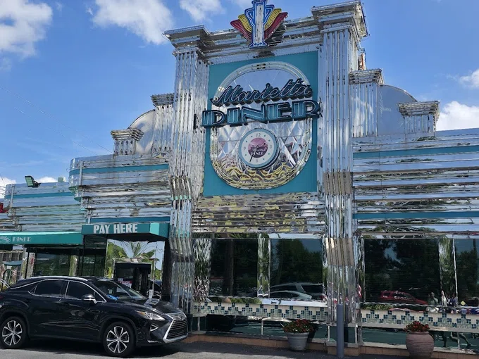
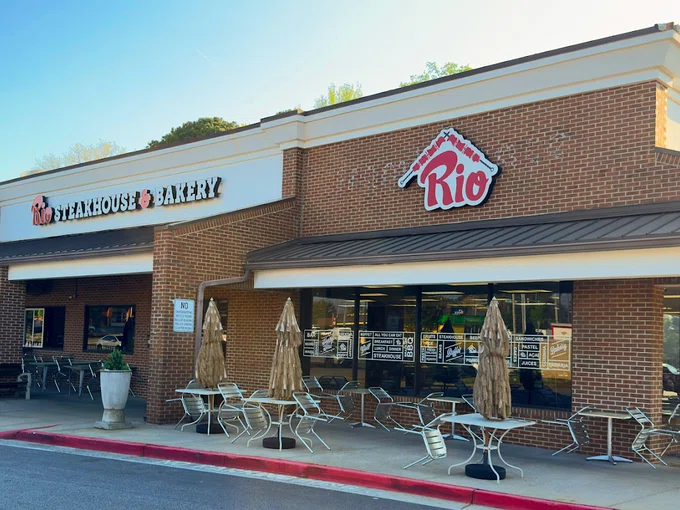
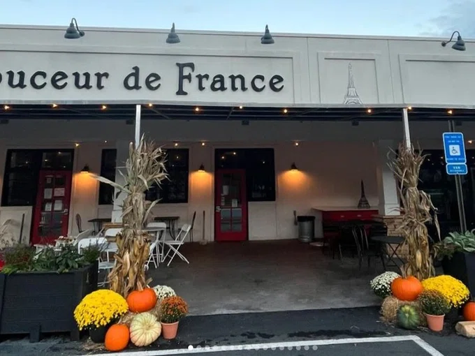
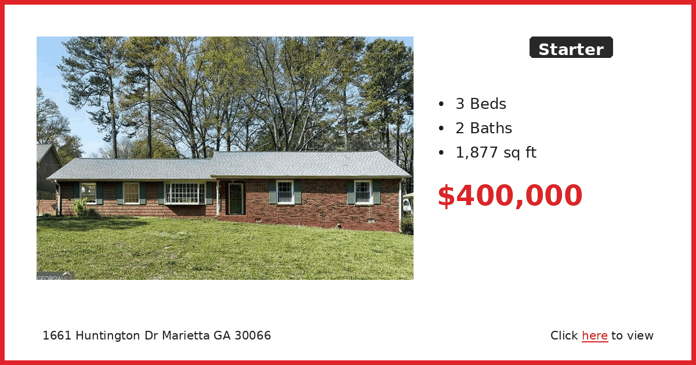
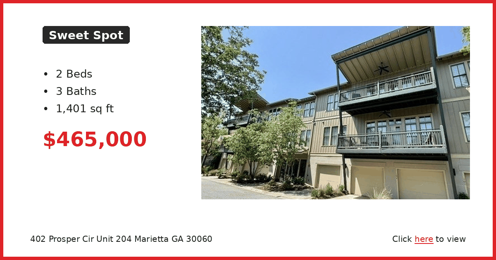
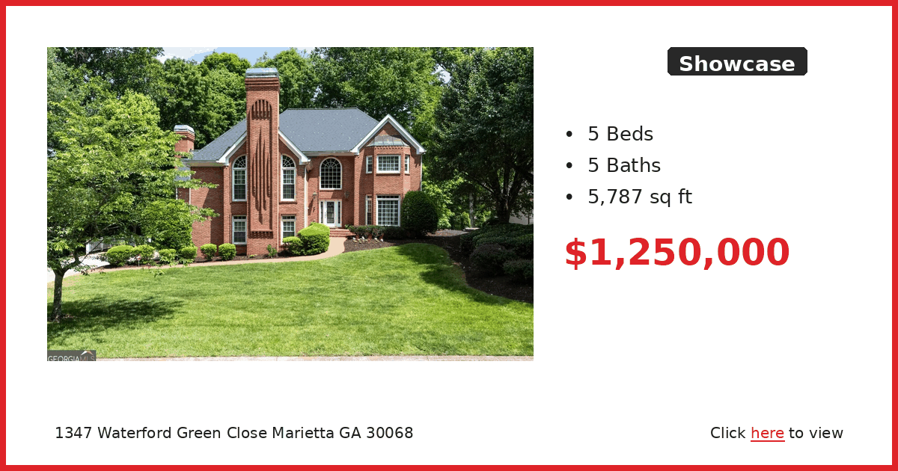

# 🗞️ East Cobb Connect — Week of May 04, 2026

*Auto-generated newsletter content for East Cobb, GA*

---

## 🐾 Furry Friends

**Otis**

Otis was scheduled to be euthanized just because of a date on a calendar. Not because he was aggressive or sick or had behavioral problems. Just because the county shelter was full and his time was up. When the rescue team found him, he was so stressed he was urinating on himself in his kennel. The moment they got him into a quiet room, he buried his head in someone's lap and didn't want to let go.

Now that he's had time to decompress at Our Pal's Place, his real personality is coming through. He's fun-loving, adores attention, and just wants to make his people happy. He remembered his house training immediately once he got out of that chaotic environment. He sits politely and his tail never stops wagging. You can tell he was someone's good boy before his world got turned upside down.

Whoever adopts Otis is going to get a dog who understands what it's like to almost lose everything and will never take a good home for granted. He's the kind of loyal companion who'll follow you around the house just to be close. Our Pal's Place is on Canton Road in Marietta. Call or email to meet him.

**Our Pal's Place**
4508 Canton Road, Marietta, GA 30062
(678) 361-7623 | helpanimals@ourpalsplace.org

[Meet Otis →](https://www.petfinder.com/dog/otis-a4cbff45-f3eb-4b4f-88a7-933944291a89/ga/marietta/our-pals-place-ga284/details/)

---

## 🍽️ Restaurant Radar

**Marietta Diner** | American Restaurant

This is the place we hit when nothing else sounds good or when we're out way too late and need real food. It's open 24/7 with that classic neon sign, and the menu is absolutely massive - like, intimidatingly huge. Perfect for when the family can't agree on what they want since they literally have everything.

The breakfast is what they're really known for, and it's the kind of portions that'll keep you full until dinner. They also do Greek dishes surprisingly well - the gyros and Greek salads are solid if you want something different from typical diner fare. My kids always get the pancakes, which are enormous.

Just know you're going to wait on weekends, especially for brunch. But hey, it's one of the few places you can get a decent meal at 2am if that's your thing.

📍 306 Cobb Pkwy SE, Marietta, GA 30060, USA | ⭐ 4.5

---

**Jerusalem Bakery & Grill** | Middle Eastern Restaurant

We discovered this place when we were looking for good Middle Eastern food without the drive into Atlanta. It's in a strip mall but don't let that fool you - the food is authentic and really well done. Great for lunch or a casual dinner when you want something different.

The shawarma is what I usually get, and it's loaded with meat and comes with really good garlic sauce. My wife loves the falafel, which is crispy outside and not dry like some places. They have solid veggie options too if that's your thing, and the hummus is made fresh.

They also have a bakery section with Middle Eastern sweets and pastries, which is nice if you want to grab dessert or take something home for later.

📍 1175 Franklin Gateway SE, Marietta, GA 30067, USA | ⭐ 4.6

---

**Rio Steakhouse & Bakery** | Steak House

This is Brazilian all-you-can-eat, so come hungry and wear loose pants. The concept is they bring different grilled meats to your table on skewers until you wave the white flag. Good for celebrations or when you want to make a real event out of dinner.

The picanha and lamb are usually the standouts, and they have this amazing cheese bread that's addictive. They also do feijoada stew, which is their traditional black bean dish if you want something different from just meat. The salad bar is actually pretty impressive too.

It's not cheap, but you definitely get your money's worth if you're a meat person. They also do breakfast, which is a nice bonus if you're staying nearby.

📍 1275 Powers Ferry Rd ste 230, Marietta, GA 30067, USA | ⭐ 4.6

---

**Marietta Square Market** | Restaurant

This is perfect when your family can't agree on what to eat since it's basically twenty restaurants under one roof. We go here a lot because I can get barbecue, my wife can get something healthier, and the kids can get pizza or whatever they're in the mood for.

The setup is like a fancy food court - you order from different vendors and then find a table. The variety is pretty impressive, from tacos to sushi to comfort food. It's right on the square in downtown Marietta, so you can walk around after if the weather's nice.

Parking can be tricky during busy times, and it gets crowded on weekends. But it's a good solution when everyone wants something different and you don't want to hit multiple restaurants.

📍 68 North Marietta Pkwy NW, Marietta, GA 30060, USA | ⭐ 4.6

---

**Douceur De France - Bakery & Brunch** | Bakery

This is the real deal French bakery that makes us feel like we're getting away with something by not having to drive to Paris. The owner is actually French, and you can tell in everything they make. Perfect for weekend brunch or grabbing pastries for a special occasion.

The baguettes are crusty and perfect, and their quiche changes daily but is always good. The petits fours are beautiful if you need something fancy for a gathering. My wife loves their croissants for weekend breakfast - they're buttery and flaky like they should be.

Just know they sell out of popular items, especially on weekends, so get there early if you want first pick. It's the kind of place that makes you realize what you've been missing from regular grocery store bakeries.

📍 277 South Marietta Pkwy SW, Marietta, GA 30064, USA | ⭐ 4.9

---

---

## 🗞️ Local Lowdown

### 🏗️ $60 million South Barrett Reliever bridge opens over I-75

A new bridge over I-75 in Kennesaw is now open after decades of planning, offering drivers an alternative to congested Barrett Parkway. The **$60 million** South Barrett Reliever project connects east and west Cobb without forcing traffic through the busy Barrett corridor packed with shops and restaurants.

This represents a major infrastructure win for commuters who've dealt with Barrett Parkway backups for years. The bridge should ease travel times for anyone heading between east and west Cobb.

More: Atlanta News First

More: [Atlanta News First](https://atlantanewsfirst.com/2026/05/01/cobb-county-leaders-aim-reduce-congestion-along-busy-corridor-with-new-bridge-over-i-75)

### 🚗 Man arrested after ramming Cobb County fire truck

A man threatened to shoot Cobb County firefighters responding to a medical emergency, then backed his car into their fire engine, according to police. The incident occurred while crews were working an active EMS call.

The arrest highlights ongoing safety concerns for first responders. Cobb County fire and EMS crews handle thousands of emergency calls annually throughout East Cobb neighborhoods.

More: EMS1

More: [EMS1](https://www.ems1.com/protecting-ems-providers-violence/ga-man-threatens-firefighters-rams-fire-engine-during-ems-call)

---

## 🏠 Real Estate Corner

### 🏠 Starter: 3/2 ranch with 1,877 sq ft on Huntington Drive

Right at $400k, this is about as much house as you'll find at this price point in East Cobb. The square footage gives you room to spread out, and Huntington Drive puts you close to everything without the premium of being right on Johnson Ferry.

[View Listing →](https://www.realtor.com/realestateandhomes-detail/1661-Huntington-Dr_Marietta_GA_30066_M66362-03521)

---

### 🏡 Sweet Spot: 2/3 condo with 3 full baths in Prosper Circle

Three full bathrooms in a 2-bedroom unit is unusual and smart for guests or a home office setup. At $465k, you're getting the East Cobb zip code and schools without the yard work, plus that third bathroom is going to come in handy.

[View Listing →](https://www.realtor.com/realestateandhomes-detail/402-Prosper-Cir-Unit-204_Marietta_GA_30060_M60342-46690)

---

### 🏰 Showcase: 5/5 custom home with nearly 6,000 sq ft in Waterford Green

When you're spending $1.25 million, you want every bedroom to have its own bathroom, and that's exactly what this house delivers. Waterford Green is one of those quiet East Cobb neighborhoods where the lots are generous and the commute to 400 is still reasonable.

[View Listing →](https://www.realtor.com/realestateandhomes-detail/1347-Waterford-Green-Close_Marietta_GA_30068_M51583-93529)

---

---

*Generated on May 04, 2026 by [Newsletter Automation](https://github.com/couch2coders/NewsletterAutomation)*
