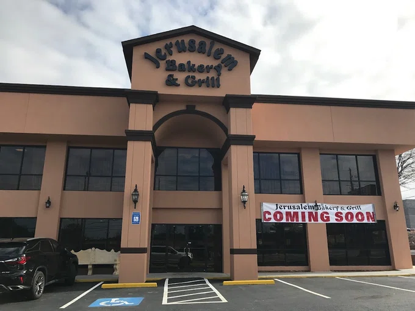
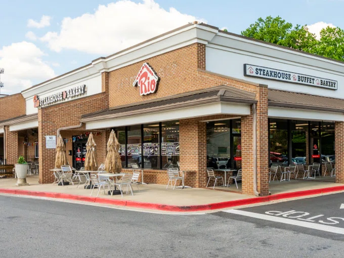
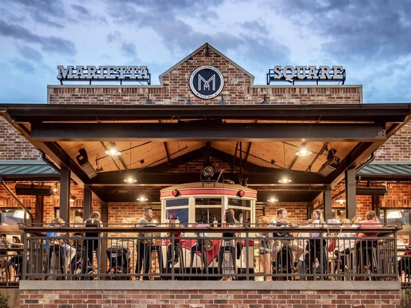
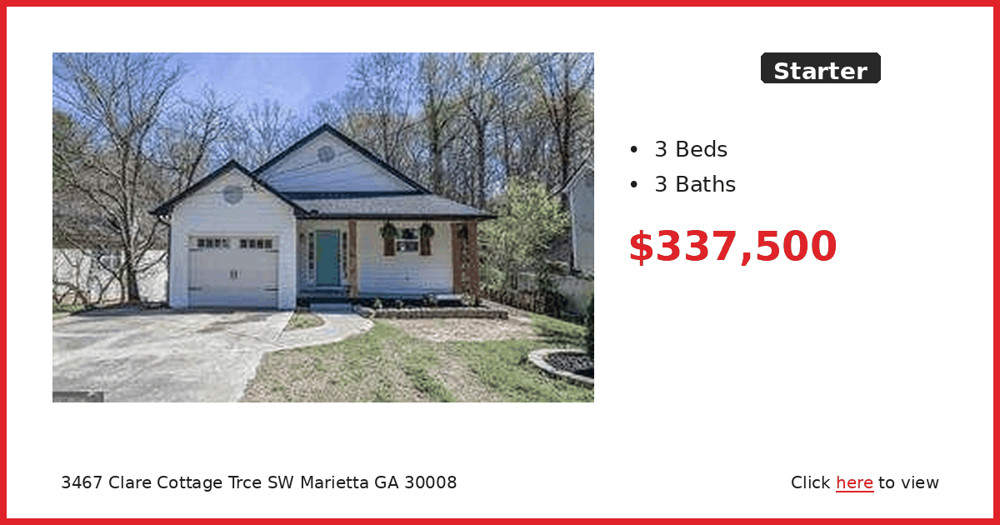
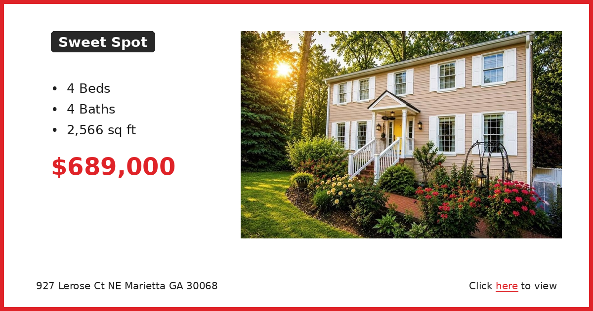
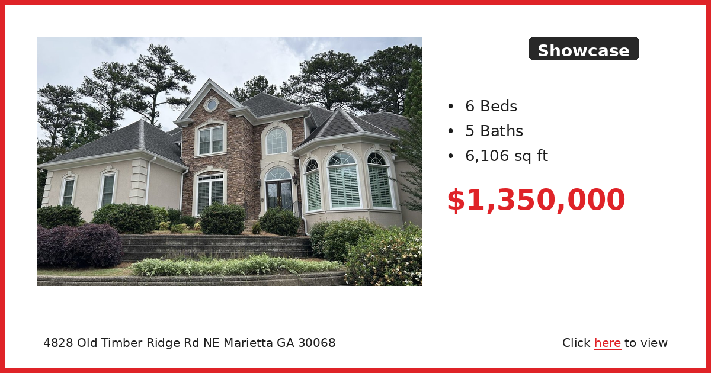

# 🗞️ East Cobb Connect — Week of June 01, 2026

*Auto-generated newsletter content for East Cobb, GA*

---

## 🐾 Furry Friends

**Otis**

Otis was scheduled to be put down just because the county shelter ran out of room. Not because he was sick or mean or anything wrong with him. Just wrong place, wrong time. When the rescue team found him, he was so stressed in that loud, crowded place that he couldn't even think straight. The moment they got him somewhere quiet, he buried his head in someone's lap and just wanted to be held.

Now he's back to being the dog he actually is. House-trained, polite, tail-wagging. He loves attention and wants nothing more than to make his people happy. Dogs like this don't end up in shelters because they're difficult. They end up there because life happens to good people who love them.

Otis is going to be the most grateful, loyal companion you'll ever have. He knows what it's like to almost lose everything, and he's not going to take a second chance for granted. Our Pal's Place is on Canton Road in Marietta. Call or email to meet him.

**Our Pal's Place**
4508 Canton Road, Marietta, GA 30062
(678) 361-7623 | helpanimals@ourpalsplace.org

[Meet Otis →](https://www.petfinder.com/dog/otis-a4cbff45-f3eb-4b4f-88a7-933944291a89/ga/marietta/our-pals-place-ga284/details/)

---

## 🍽️ Restaurant Radar

**Marietta Diner** | American Restaurant

This is the place I send people when they want a real diner experience without driving to downtown Atlanta. It's got that classic neon sign out front and they're open 24/7, which saves us when we need late-night food or early breakfast before a flight. The kind of place where you can get pancakes at midnight or a burger at 6am without anyone batting an eye.

The menu is massive and includes Greek dishes alongside typical diner fare, so there's something for everyone in the family. Their breakfast portions are huge and the Greek specialties are actually good, not just thrown on the menu as an afterthought.

Just know the parking lot can get crazy busy, especially weekend mornings when the after-church crowd hits.

📍 306 Cobb Pkwy SE, Marietta, GA 30060, USA | ⭐ 4.5

---

**Jerusalem Bakery & Grill** | Middle Eastern Restaurant

This is my go-to when I want something different but not too adventurous for the kids. The atmosphere is casual and the staff is patient with questions if you're not familiar with Middle Eastern food. Good option when you want to eat healthy without feeling like you're on a diet.

The shawarma and falafel are what most people order, and both are consistently good. They have plenty of veggie options and the portions are generous without being overwhelming. The desserts are worth trying if you have room, especially if you like things that aren't overly sweet.

📍 1175 Franklin Gateway SE, Marietta, GA 30067, USA | ⭐ 4.6

---

**Rio Steakhouse & Bakery** | Steak House

If you've never done Brazilian all-you-can-eat barbecue, this is a good introduction without the intimidation factor of some of the fancier places. The atmosphere is relaxed and the servers are good about explaining how everything works. Perfect for celebrating something or when you want to eat way too much meat.

The cheese bread alone is worth the trip, and they keep bringing different cuts of meat to your table until you wave the white flag. The feijoada stew is authentic if you want to try something traditional. They also do breakfast, which is unusual for this type of restaurant.

Come hungry and pace yourself with the salad bar, or you'll fill up before the good stuff arrives.

📍 1275 Powers Ferry Rd ste 230, Marietta, GA 30067, USA | ⭐ 4.6

---

**Marietta Square Market** | Restaurant

This food hall is perfect when your family can't agree on what to eat. Twenty different vendors means everyone gets what they want and you can all sit together. It's also nice when you want to try a few different things without committing to a full meal from one place.

The variety is impressive and the quality is generally good across the vendors. Good option for a casual lunch or when you're shopping around the square and want to grab something quick. The setup works well for groups or families with picky eaters.

📍 68 North Marietta Pkwy NW, Marietta, GA 30060, USA | ⭐ 4.6

---

**Douceur De France - Bakery & Brunch** | Bakery

This is where I go when I want to feel fancy without getting dressed up. The French pastries are legit and the quiches make for a nice light lunch that doesn't leave you feeling heavy. Perfect for meeting a friend for coffee or grabbing something special for breakfast at home.

Their baguettes are the real deal and the petits fours are beautiful if you need something for a small gathering. The atmosphere is bright and cheerful, which makes it a nice spot to sit and catch up with someone. Everything tastes authentic, not like American versions of French food.

📍 277 South Marietta Pkwy SW, Marietta, GA 30064, USA | ⭐ 4.9

---

---

## 🗞️ Local Lowdown

### 🚰 Cobb water system reports sewage overflow

The Cobb County Water System reported a **160-gallon** wastewater sewer overflow on **May 28**. The spill has been contained and cleanup efforts are underway.

While 160 gallons is relatively small for these types of incidents, residents should stay alert for any water quality notices from the county in affected areas.

More: [MDJ](https://mdjonline.com/news/cobb-county-water-system-reports-160-gallon-sewage-overflow/article_f39a9d63-0645-43e0-a989-b80e649fcb9a.html)

---

## 🏠 Real Estate Corner

### 🏠 Starter: 3/3 townhome under $340k in Clare Cottage

Three full baths in a starter home is pretty unusual around here, especially at this price point. The Clare Cottage community puts you close to East Cobb amenities without the East Cobb price tag.

[View Listing →](https://www.realtor.com/realestateandhomes-detail/3467-Clare-Cottage-Trce-SW_Marietta_GA_30008_M68907-68397)

---

### 🏡 Sweet Spot: 4/4 in East Cobb proper under $700k

Four bedrooms and four full baths on Lerose Court puts you right in the heart of East Cobb school district territory. At 2,566 square feet, there's room for everyone without feeling cramped.

[View Listing →](https://www.realtor.com/realestateandhomes-detail/927-Lerose-Ct-NE_Marietta_GA_30068_M56919-90039)

---

### 🏰 Showcase: 6,000+ square feet on Old Timber Ridge

Six bedrooms and over 6,000 square feet means this Old Timber Ridge house has space for everything. At $1.35M, you're getting serious square footage in one of East Cobb's established neighborhoods.

[View Listing →](https://www.realtor.com/realestateandhomes-detail/4828-Old-Timber-Ridge-Rd-NE_Marietta_GA_30068_M59254-80487)

---

---

*Generated on June 01, 2026 by [Newsletter Automation](https://github.com/couch2coders/NewsletterAutomation)*
