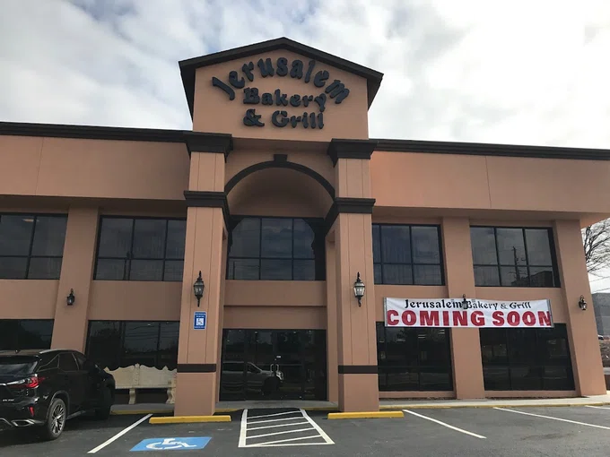
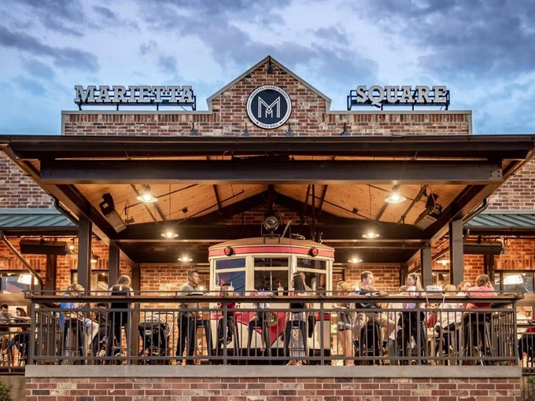
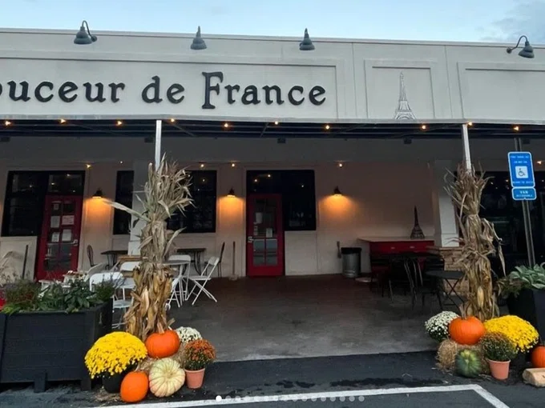
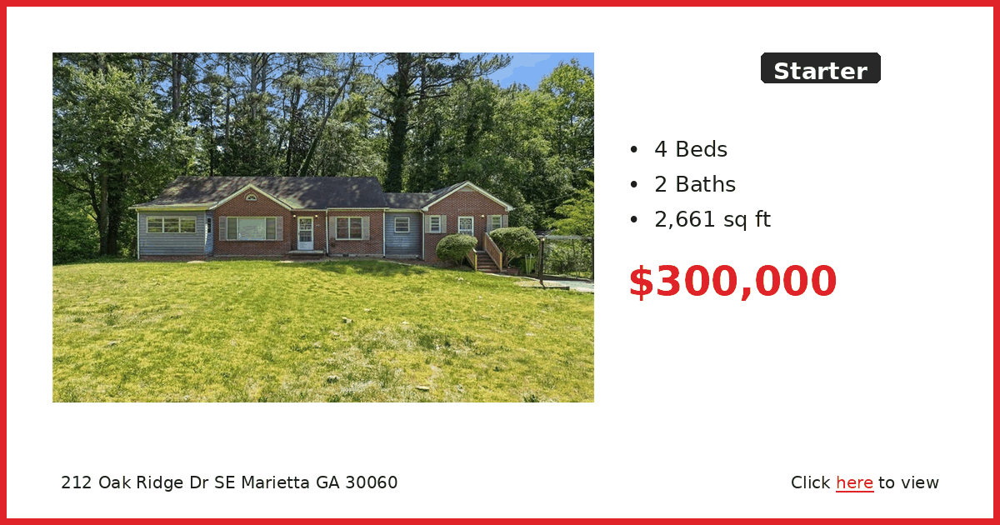
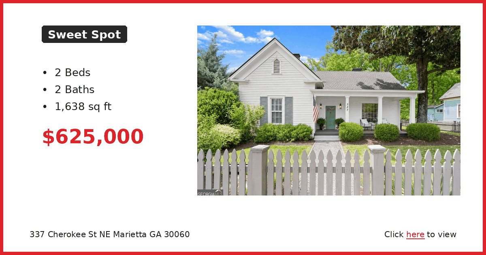
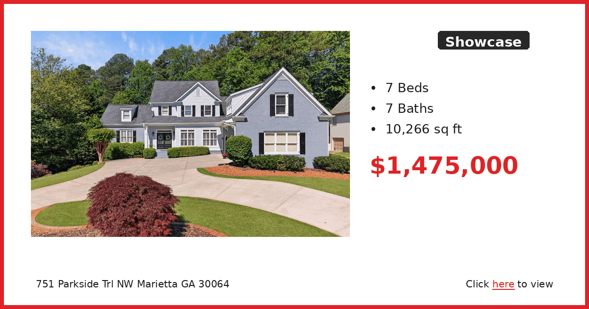

# 🗞️ East Cobb Connect — Week of May 11, 2026

*Auto-generated newsletter content for East Cobb, GA*

---

## 🐾 Furry Friends

**Otis**

Otis was on the euthanasia list at the county shelter just because of his intake date. When the rescue team found him, he was so stressed he was peeing on himself in his kennel. But the second they got him to a quiet room, he buried his head in someone's lap and just wanted to be loved.

Now that he's had time to decompress, Otis has turned back into the fun-loving guy he always was. He remembered his house training immediately, sits politely, and his tail never stops wagging. He's one of those dogs who just wants to please his people and be close to them. The stress at the shelter was making him forget everything he knew.

Whoever gets Otis is going to have a loyal companion who's been through enough to really appreciate a good home. He's proof that sometimes a dog just needs the right environment to show you who they really are.

Our Pal's Place is on Canton Road in Marietta. Call or email to start the adoption process and meet this sweet guy in person.

**Our Pal's Place**
4508 Canton Road, Marietta, GA 30062
(678) 361-7623 | helpanimals@ourpalsplace.org

[Meet Otis →](https://www.petfinder.com/dog/otis-a4cbff45-f3eb-4b4f-88a7-933944291a89/ga/marietta/our-pals-place-ga284/details/)

---

## 🍽️ Restaurant Radar

**Marietta Diner** | American Restaurant

This is the place we end up at 2am when nothing else is open, or Sunday morning when I want a massive breakfast without the wait. It's a proper old-school diner with that classic neon sign, and they never close. The menu is absolutely huge - like phone book thick - so you'll find whatever you're craving. They do all the Greek classics too since it's Greek-owned, so the gyros and spanakopita are solid. The portions are generous and the coffee flows freely. Just know it can get packed during weekend breakfast hours, but the turnover is fast.

📍 306 Cobb Pkwy SE, Marietta, GA 30060, USA | ⭐ 4.5

---

**Jerusalem Bakery & Grill** | Middle Eastern Restaurant

When I'm craving Middle Eastern food, this is my go-to spot in East Cobb. It's casual and welcoming, perfect for a quick lunch or family dinner when you want something different from the usual. The shawarma is what most people order and it's consistently good - they pile it high with meat and all the fixings. My wife loves their falafel, especially since they have great veggie options that actually fill you up. Don't skip the desserts if you have room - they make some incredible Middle Eastern sweets that are worth the extra calories.

📍 1175 Franklin Gateway SE, Marietta, GA 30067, USA | ⭐ 4.6

---

**Rio Steakhouse & Bakery** | Steak House

If you've never done Brazilian all-you-can-eat, this is a great place to try it without the downtown Atlanta prices. The servers come around with skewers of different meats - just flip your card to green when you want more. The cheese bread alone is worth the trip, and they keep bringing fresh ones to your table. They also do feijoada stew if you want something beyond the barbecue, plus they serve breakfast which is kind of unique for this style of restaurant. It's relaxed and family-friendly, not stuffy like some steakhouses. Just pace yourself because it's easy to overdo it on the cheese bread before the good stuff comes around.

📍 1275 Powers Ferry Rd ste 230, Marietta, GA 30067, USA | ⭐ 4.6

---

**Marietta Square Market** | Restaurant

This food hall is perfect when everyone in your group wants something different. Twenty different vendors under one roof means someone's getting tacos, someone else is getting Asian, and the kids can get pizza. It's right on the Marietta Square so you can walk around after eating, and there's usually good parking nearby. The variety is impressive - way more than your typical mall food court. It's become our go-to when we want to meet friends but can't agree on a restaurant. The setup works well for families too since kids can see all their options and parents don't have to negotiate.

📍 68 North Marietta Pkwy NW, Marietta, GA 30060, USA | ⭐ 4.6

---

**Douceur De France - Bakery & Brunch** | Bakery

This is where I go when I want to pretend I'm in France for an hour. The owner is actually French and it shows in everything they make - the baguettes, croissants, and quiches are the real deal. Perfect for a weekend brunch when you want something special, or grabbing pastries for a meeting. The petits fours are beautiful if you need something for a party, and they do custom orders too. It's bright and cheerful inside, good for catching up with friends over coffee and a proper French pastry. Just know they can sell out of popular items by afternoon, so go early if you have your heart set on something specific.

📍 277 South Marietta Pkwy SW, Marietta, GA 30064, USA | ⭐ 4.9

---

---

## 🗞️ Local Lowdown

### 🚗 I-285 East lanes closed at Cobb Cloverleaf after crash

A significant crash shut down all eastbound lanes of I-285 through the Cobb Cloverleaf early Friday morning. The closure affects the critical interchange where I-285 meets I-75, creating major traffic delays for commuters heading toward the perimeter.

Drivers should expect extended delays and consider alternate routes during morning rush hour. Check real-time traffic apps before heading out.

More: [11Alive](https://11alive.com/article/traffic/i-285-traffic-crash-near-i-75/85-df6e755e-a586-4306-9806-43512af9d706)

---

## 🏠 Real Estate Corner

### 🏠 Starter: 4-bedroom ranch for $300k near the Square

Four bedrooms and 2,600 square feet for under $300k is pretty rare around here these days. The location puts you close to Marietta Square and gives you room to grow without the big mortgage.

[View Listing →](https://www.realtor.com/realestateandhomes-detail/212-Oak-Ridge-Dr-SE_Marietta_GA_30060_M65247-10119)

---

### 🏡 Sweet Spot: Downtown Marietta cottage with character

This Cherokee Street spot gives you walkable access to everything downtown Marietta offers. Two bedrooms might seem small, but the location and charm factor make up for it if you're not hunting for extra space.

[View Listing →](https://www.realtor.com/realestateandhomes-detail/337-Cherokee-St-NE_Marietta_GA_30060_M58783-55092)

---

### 🏰 Showcase: 10,000-square-foot estate with 7 bedrooms

Seven bedrooms and seven baths on Parkside Trail means you're looking at serious entertaining space. At over 10,000 square feet, this is the kind of house where you need a map for the first few weeks.

[View Listing →](https://www.realtor.com/realestateandhomes-detail/751-Parkside-Trl-NW_Marietta_GA_30064_M66176-75347)

---

---

*Generated on May 11, 2026 by [Newsletter Automation](https://github.com/couch2coders/NewsletterAutomation)*
