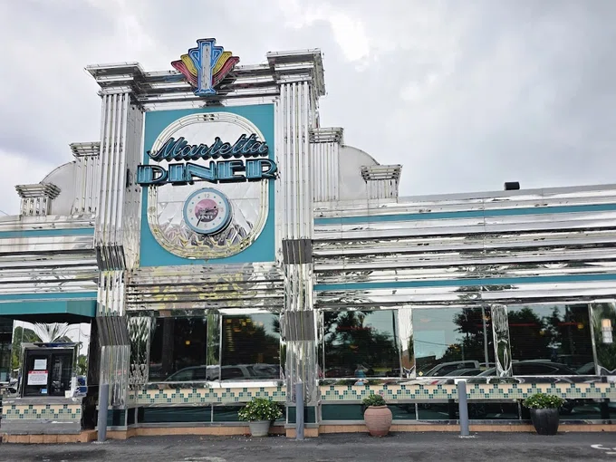
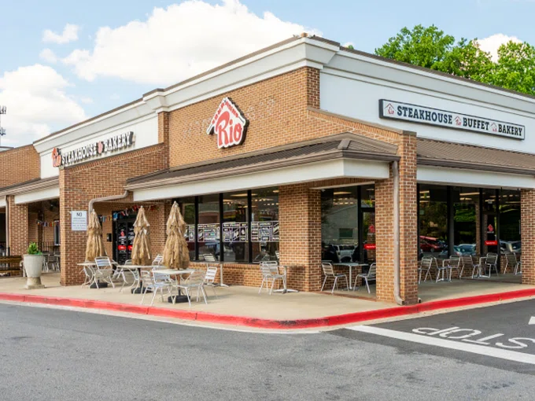
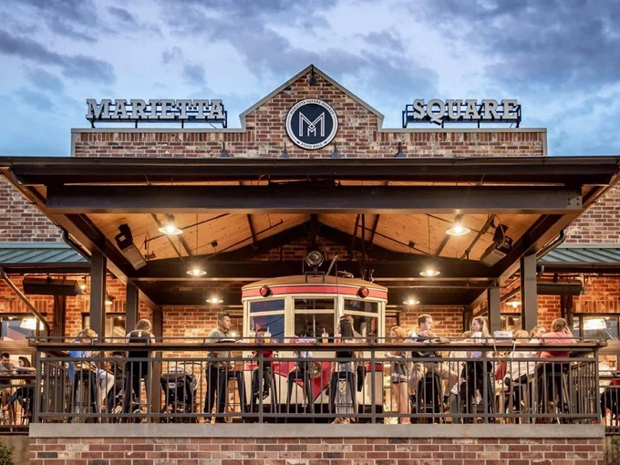
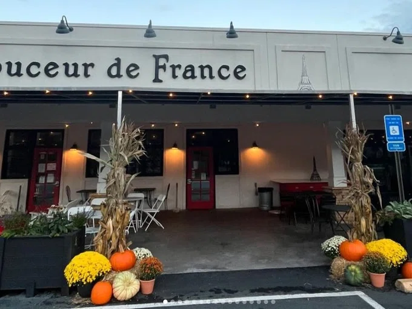
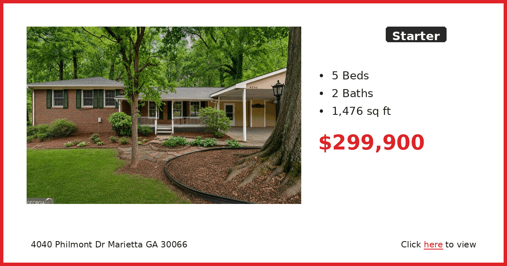
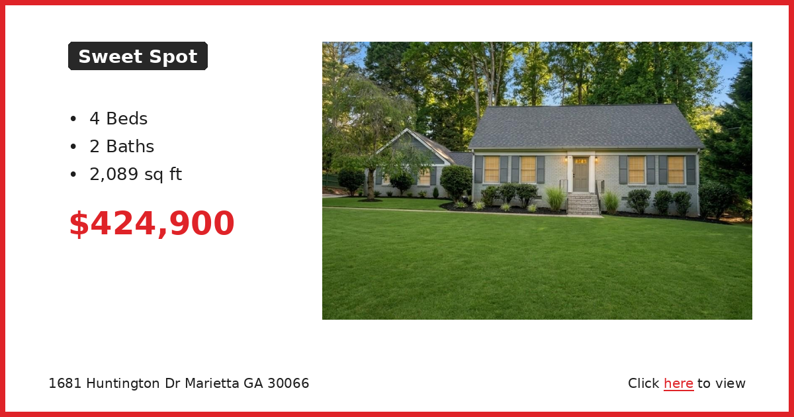

# 🗞️ East Cobb Connect — Week of June 15, 2026

*Auto-generated newsletter content for East Cobb, GA*

---

## 🐾 Furry Friends

**Sitka**

The Alaska kittens showed up at Good Mews after their mom got them out of a county shelter situation. Sitka is one of four siblings who are everything you want in a kitten: playful, cuddly, curious, and full of personality. She spends her days chasing toys and wrestling with her brothers and sister, then curls up for snuggles when she's tired herself out.

These kittens would love to be adopted in pairs if you can swing it. Two kittens are actually easier than one most of the time anyway. They entertain each other, learn manners from each other, and you get twice the fun. If you're thinking about adding a kitten to your family, this might be the perfect time to add two.

Good Mews is a no-kill, cage-free shelter on Robinson Road in Marietta. You'll need to submit an inquiry and visit in person to meet Sitka and her siblings. Call or email to get the process started.

**Good Mews Animal Foundation**
3805 Robinson Road, Marietta, GA 30067
(770) 499-2287 | adopt@goodmews.org

[Meet Sitka →](https://www.petfinder.com/cat/sitka-c90aa476-adc5-4fe8-b791-ddfc9f4cdd39/ga/marietta/good-mews-animal-foundation-ga173/details/)

---

## 🍽️ Restaurant Radar

**Marietta Diner** | American Restaurant

This is the kind of old-school diner that's been feeding Cobb County for decades. It's open 24/7, which is clutch when you need breakfast at 2am or a late dinner after a long day. The neon sign out front gives it that classic diner vibe, and inside it's exactly what you'd expect.

The menu is massive and includes Greek specialties alongside typical diner fare. I usually go for their big breakfasts, which are exactly that - big portions that'll keep you full. The Greek dishes are solid too if you want something different from the usual eggs and pancakes.

With over 20,000 reviews and still holding a 4.5 rating, it's clearly doing something right. Good backup plan when everything else is closed.

📍 306 Cobb Pkwy SE, Marietta, GA 30060, USA | ⭐ 4.5

---

**Jerusalem Bakery & Grill** | Middle Eastern Restaurant

This place hits the spot when I'm craving Middle Eastern food but want something casual and quick. It's in a shopping center off Franklin Gateway, and the vibe is easygoing - perfect for lunch or grabbing dinner to take home. They've got vegetarian options too, which my wife appreciates.

The shawarma and falafel are what most people order, and both are solid. They also do desserts if you want to try something sweet after your meal. The portions are decent and the flavors are on point without being too heavy.

With over 5,000 reviews and a 4.6 rating, it's clearly a local favorite. Good option when you want something different from the usual pizza and burgers.

📍 1175 Franklin Gateway SE, Marietta, GA 30067, USA | ⭐ 4.6

---

**Rio Steakhouse & Bakery** | Steak House

This is Brazilian all-you-can-eat done right, and way more relaxed than some of the fancier churrasco places. They bring the barbecue to your table, and the cheese bread alone makes it worth the trip. Good for celebrating something or when you want to eat way too much meat without feeling guilty about it.

Beyond the endless barbecue, they do feijoada stew and even serve breakfast. The variety keeps it interesting, and you're definitely getting your money's worth. It's the kind of place where you roll out the door completely satisfied.

Located up on Powers Ferry Road, so easy to get to from East Cobb. Just don't plan on doing much after you eat here.

📍 1275 Powers Ferry Rd Ste 230, Marietta, GA 30067, USA | ⭐ 4.6

---

**Marietta Square Market** | Restaurant

This food hall is perfect when your group can't agree on what to eat. Twenty different restaurants and vendors all under one roof, so everyone can get what they want. It's right by the Square, which makes it convenient if you're already downtown for something else.

The range of cuisines means you can try something new or stick with your usual. Good setup for families where the kids want one thing and the adults want another. Plus there's retail mixed in if you want to browse after eating.

It's got that modern food hall vibe but without feeling too trendy. Easy parking and a solid 4.6 rating with thousands of reviews.

📍 68 North Marietta Pkwy NW, Marietta, GA 30060, USA | ⭐ 4.6

---

**Douceur De France - Bakery & Brunch** | Bakery

This French bakery is the real deal, and the 4.9 rating with over 17,000 reviews backs that up. It's bright and welcoming inside, and the smell when you walk in is exactly what you want from a proper bakery. Perfect for weekend brunch or grabbing pastries for the office.

Their baguettes are legit, and the petits fours are beautiful if you need something for a special occasion. The quiches make for a good light lunch, and everything tastes authentically French without being pretentious about it.

It's on South Marietta Parkway, so not too far out of the way. Just know it's popular, especially on weekends, so there might be a wait for tables.

📍 277 South Marietta Pkwy SW, Marietta, GA 30064, USA | ⭐ 4.9

---

---

## 🗞️ Local Lowdown

### 🗳️ Early voting continues for primary runoff through Friday

Over **1,800 Cobb voters** cast ballots this weekend as early voting opened for the primary runoff election. Early voting continues at locations across the county through **Friday, June 21**, with Election Day on **Tuesday, June 24**.

This runoff will decide several key races that didn't reach 50% in the May primary. Check your polling location and sample ballot at My Voter Page on the Georgia Secretary of State website.

More: [Marietta Daily Journal](https://mdjonline.com/news/elections/early-voting-underway-across-cobb/article_1fc60290-954c-4dfa-9eb6-2c1acd0072a0.html)

### 🍽️ Cobb Foodie Week starts Thursday with dining deals

Cobb Travel & Tourism is hosting **Cobb Foodie Week from June 20-27**, featuring special menus and deals at participating restaurants across the county. This annual event showcases the best of Cobb's dining scene with discounted prix fixe menus and unique offerings.

It's a chance to try new spots or revisit favorites at a discount during the summer dining season.

More: [Marietta Daily Journal](https://mdjonline.com/dining/cobb-foodie-week-is-june-20-27/article_4001db66-d917-428f-be87-c0f6e799c52b.html)

### 🌧️ Heavy rain creates flood watch and road hazards

Cobb County was under a **flood watch Monday afternoon through late night** as heavy rain and thunderstorms moved through the area. The weather created road hazards and standing water concerns across the county.

Keep an eye on weather alerts and avoid driving through flooded roadways. Turn around, don't drown applies even to familiar routes during heavy rain events.

---

## 🏠 Real Estate Corner

### 🏠 Starter: 5-bedroom ranch under $300k in East Cobb

Five bedrooms for under $300k is practically unheard of in East Cobb these days. Sure, it's only two baths and needs some updates, but you're getting East Cobb schools and a lot of space to work with at this price point.

[View Listing →](https://www.realtor.com/realestateandhomes-detail/4040-Philmont-Dr_Marietta_GA_30066_M52742-67866)

---

### 🏡 Sweet Spot: 4/2 with over 2,000 square feet near Huntington

This hits the sweet spot for families wanting East Cobb without the $600k price tag. Four bedrooms and over 2,000 square feet gives you room to spread out, and you're still in the good school district everyone's chasing.

[View Listing →](https://www.realtor.com/realestateandhomes-detail/1681-Huntington-Dr_Marietta_GA_30066_M53667-27818)

---

### 🏰 Showcase: Estate home with chef's kitchen in Whitlock Preserve

This is what $1.3M looks like in East Cobb's premier neighborhood. Six bedrooms, four full baths, and a gourmet kitchen that opens to a family room with coffered ceilings and built-ins.

[View Listing →](https://example.com/showcase-listing)

---

---

*Generated on June 15, 2026 by [Newsletter Automation](https://github.com/couch2coders/NewsletterAutomation)*
