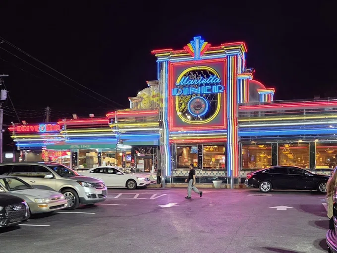
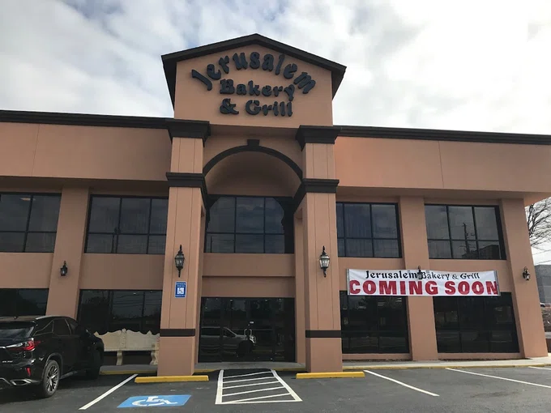
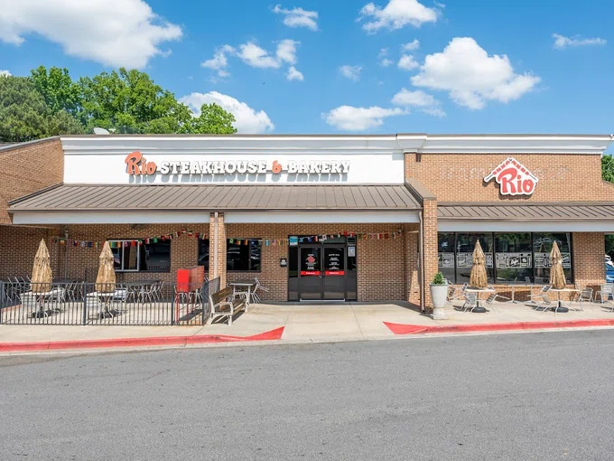
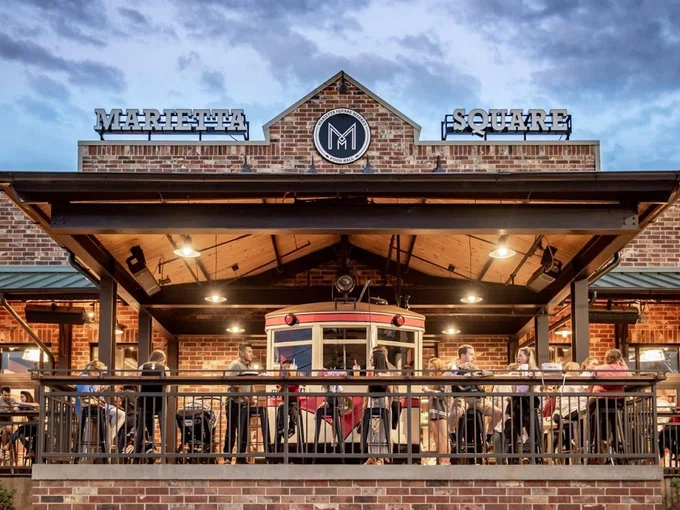
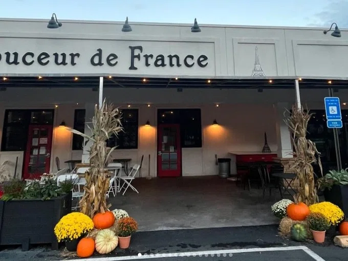
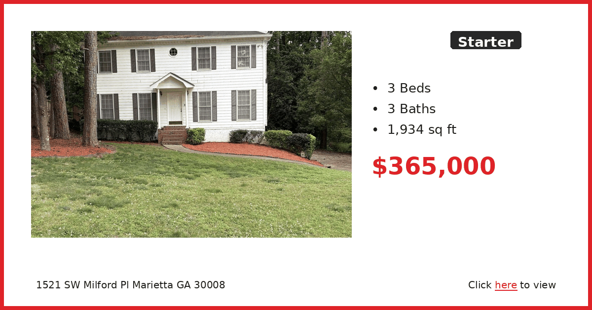
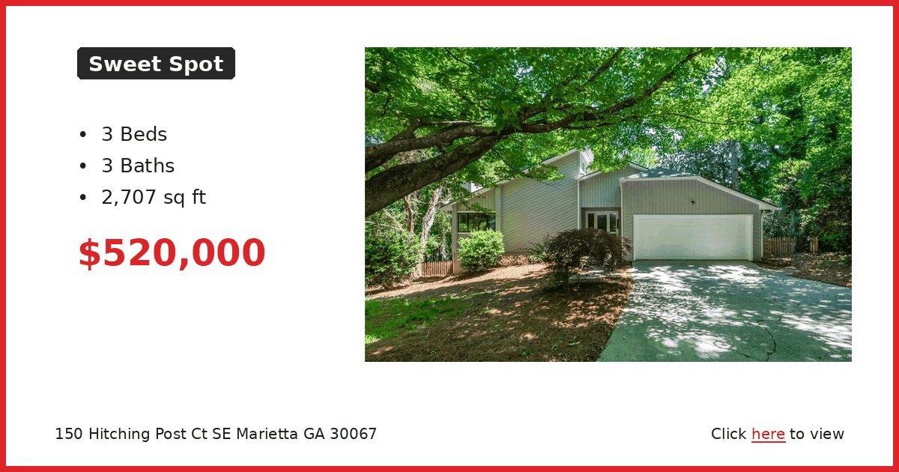
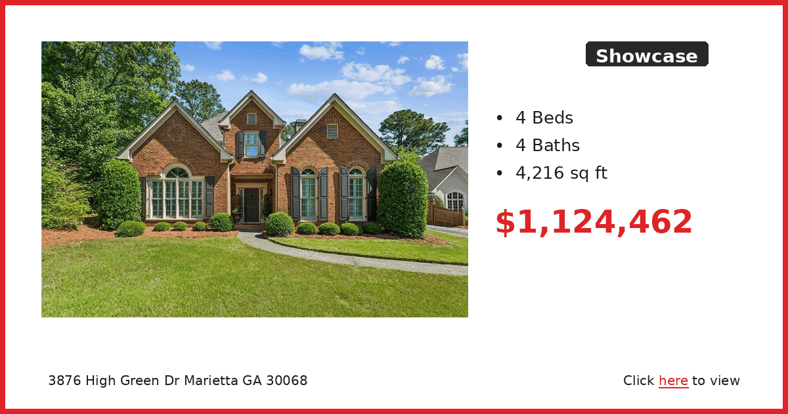

# 🗞️ East Cobb Connect — Week of May 25, 2026

*Auto-generated newsletter content for East Cobb, GA*

---

## 🐾 Furry Friends

**Unknown**

Otis was on the county shelter's kill list for the worst possible reason: he was just there when they ran out of space. When the rescue team found him, he was so stressed he couldn't even show his real personality. But get him out of that chaos and into a quiet room? He immediately buried his head in someone's lap and started wagging his tail again.

Now that he's had time to decompress, his real self is coming through. He's house-trained, sits politely, and just wants to make his people happy. The volunteers say he's loyal and loving, the kind of dog who remembers every kindness you show him. He's not asking for much. Just a calm home where he can be the companion he was always meant to be.

Whoever adopts Otis is getting a dog who knows what it's like to lose everything and will never take a good home for granted. Our Pal's Place is on Canton Road in Marietta. Call or email to set up a meet and greet.

**Our Pal's Place**
4508 Canton Road, Marietta, GA 30062
(678) 361-7623 | helpanimals@ourpalsplace.org

---

## 🍽️ Restaurant Radar

**Marietta Diner** | American Restaurant

This is the kind of place that's been saving my bacon for years when I need food at weird hours. It's open 24/7 with that classic neon sign you can spot from Cobb Parkway, and the menu is absolutely massive. Perfect for late-night cravings, early breakfast meetings, or when you're coming home from the airport at midnight. The breakfast is what keeps people coming back - huge portions and they do it right. They also have Greek specialties mixed in with the typical diner fare, which is a nice surprise. The service is fast and they've seen it all, so don't worry about rolling in at 2am looking rough.

📍 306 Cobb Pkwy SE, Marietta, GA 30060, USA | ⭐ 4.5

---

**Jerusalem Bakery & Grill** | Middle Eastern Restaurant

This place is a gem tucked into Franklin Gateway that we discovered when we were craving something different from the usual chain options. The atmosphere is casual and welcoming, not fancy but comfortable. Great for families or a quick lunch when you want something fresh and flavorful. The shawarma is what most people come for and it's consistently good - they pile it high and the meat is tender. The falafel is crispy outside and fluffy inside, and they have plenty of vegetarian options that actually taste good. Don't skip dessert if you have room - the Middle Eastern sweets are worth the extra calories.

📍 1175 Franklin Gateway SE, Marietta, GA 30067, USA | ⭐ 4.6

---

**Rio Steakhouse & Bakery** | Steak House

If you've never done Brazilian barbecue, this is a great place to try it without the downtown Atlanta drive. It's all-you-can-eat with servers walking around with different cuts of meat on skewers - just flip your card to green when you want more. The atmosphere is relaxed and family-friendly, not stuffy like some steakhouses. The cheese bread alone is worth the trip, and the feijoada stew is authentic if you're feeling adventurous. They also do breakfast, which is unusual for a steakhouse but works well for weekend brunches. Come hungry because you'll definitely get your money's worth, and pace yourself with the salad bar.

📍 1275 Powers Ferry Rd ste 230, Marietta, GA 30067, USA | ⭐ 4.6

---

**Marietta Square Market** | Restaurant

This food hall is perfect when your family can't agree on what to eat or you want to try a few different things. It's right off the Marietta Square with twenty different vendors, so there's something for everyone from tacos to Asian food to classic American. Great for lunch meetings where people have different dietary needs or when you're downtown for an event and want options. The setup reminds me of the food courts from when I was a kid, but way better quality. You can grab a beer and wander around to see what looks good, or split up and meet back at a table. Parking can be tricky during events, so plan accordingly.

📍 68 North Marietta Pkwy NW, Marietta, GA 30060, USA | ⭐ 4.6

---

**Douceur De France - Bakery & Brunch** | Bakery

This little French bakery is the real deal and has become my go-to for special occasion breakfasts or when I want to feel fancy on a Saturday morning. The space is bright and cheerful, and you can smell the fresh baking from the parking lot. Perfect for date mornings, birthday breakfasts, or treating yourself after a rough week. The baguettes are crispy and authentic, the quiches are rich and satisfying, and the petits fours are almost too pretty to eat. Everything tastes like it came straight from a Parisian bakery. Get there early on weekends because the good stuff goes fast, and don't be surprised if there's a line - it's worth the wait.

📍 277 South Marietta Pkwy SW, Marietta, GA 30064, USA | ⭐ 4.9

---

---

## 🗞️ Local Lowdown

### 🗳️ Voting extended at 11 Cobb precincts due to technical issues

Technical problems with Cobb County's voting system forced officials to extend polling hours at **11 precincts** during the primary election. Multiple voters reported issues to local news stations throughout the day.

The extensions allowed affected voters to cast ballots despite the system glitches. County elections officials worked to resolve the technical problems while keeping impacted polling locations open past the standard 7 p.m. closing time.

More: [WSB-TV](https://www.wsbtv.com/news/local/cobb-county-elections-having-technical-issues-with-system-some-locations/6M5NTEGCRJG4VHINVS3MNXW42Q/)

---

## 🏠 Real Estate Corner

### 🏠 Starter: 3/3 townhome in Milford for under $370k

Three full bathrooms in a starter home is pretty rare around here, especially at this price point. The location puts you close to the Silver Comet Trail and you're still in the East Cobb school district without paying the premium for a detached house.

[View Listing →](https://www.realtor.com/realestateandhomes-detail/1521-Milford-Pl-SW_Marietta_GA_30008_M55932-42812)

---

### 🏡 Sweet Spot: 2,700 sq ft on Hitching Post Court

This is solid East Cobb living without the million-dollar price tag. You get space to spread out, the schools everyone moves here for, and you're right off Johnson Ferry Road for an easy commute anywhere.

[View Listing →](https://www.realtor.com/realestateandhomes-detail/150-Hitching-Post-Ct-SE_Marietta_GA_30067_M50770-69093)

---

### 🏰 Showcase: New construction on High Green Drive

Over 4,000 square feet of brand new everything in one of East Cobb's most established neighborhoods. At just over $1.1 million, you're getting contemporary finishes and four full baths without the $1.5M+ price tag of similar homes nearby.

[View Listing →](https://www.realtor.com/realestateandhomes-detail/3876-High-Green-Dr_Marietta_GA_30068_M58786-01432)

---

---

*Generated on May 25, 2026 by [Newsletter Automation](https://github.com/couch2coders/NewsletterAutomation)*
