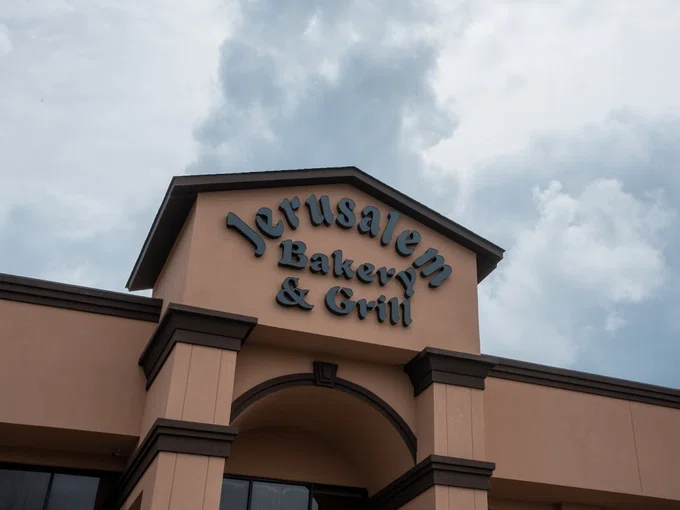
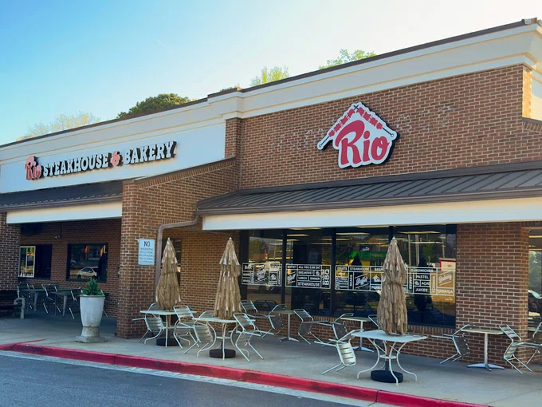
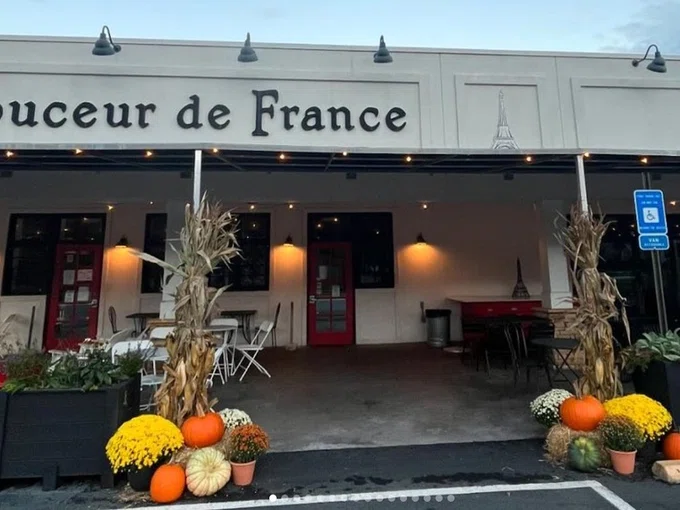
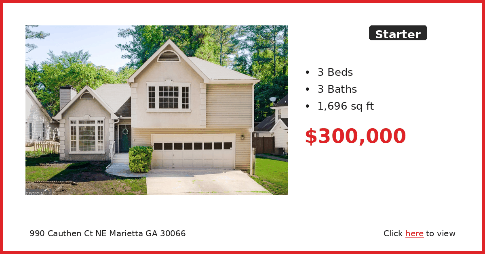
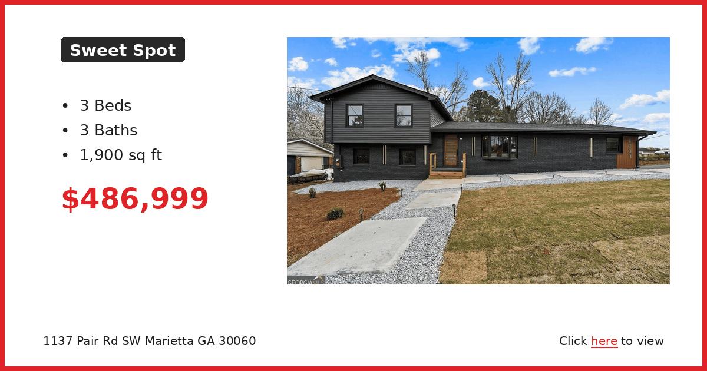
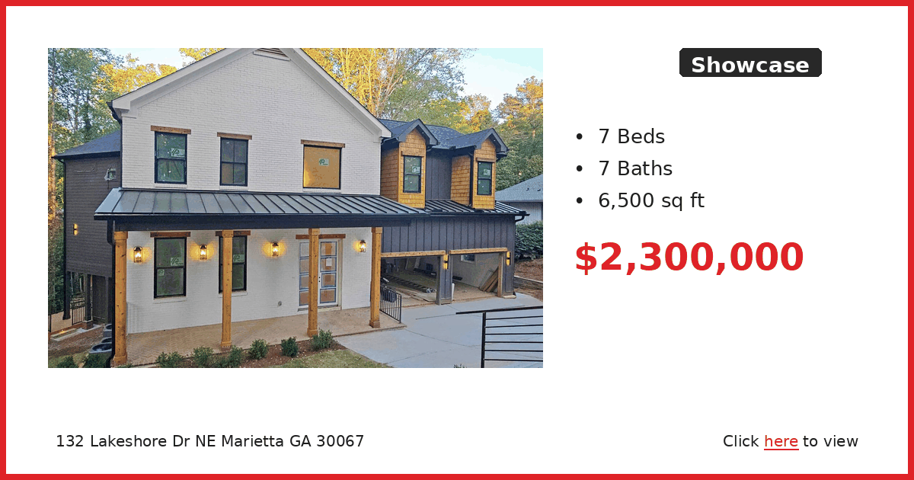

# 🗞️ East Cobb Connect — Week of May 18, 2026

*Auto-generated newsletter content for East Cobb, GA*

---

## 🐾 Furry Friends

**Otis**

Otis was on a county shelter's kill list, stressed out of his mind in an overcrowded, loud environment. He was literally urinating on himself from anxiety. But the moment he got out of that cell and into a quiet room, something amazing happened. He buried his head in a volunteer's lap and just exhaled. He didn't need training or fixing. He just needed out.

At Our Pal's Place, Otis has turned back into who he really is: a fun-loving guy who adores attention and wants nothing more than to make his humans happy. He remembered his house-training immediately. He remembered how to sit politely and wag his tail. All that stress just melted away once he felt safe again.

This is a dog who will be grateful every single day that you chose him. He's been through the worst-case scenario and came out the other side still believing in people. If you're looking for a loyal companion who will never take you for granted, Otis is your guy.

Our Pal's Place is a no-kill rescue on Canton Road in Marietta. Call or email to start the adoption process and meet Otis in person.

**Our Pal's Place**
4508 Canton Road, Marietta, GA 30062
(678) 361-7623 | helpanimals@ourpalsplace.org

[Meet Otis →](https://www.petfinder.com/dog/otis-a4cbff45-f3eb-4b4f-88a7-933944291a89/ga/marietta/our-pals-place-ga284/details/)

---

## 🍽️ Restaurant Radar

**Marietta Diner** | American Restaurant

This is the kind of place that saves you when nothing else is open. It's been a Cobb County institution forever, with that classic neon sign and booths that have seen decades of late-night conversations. Open 24/7, so whether you need breakfast at 3am or dinner after a long day, they've got you covered. The menu is massive and includes Greek dishes alongside all the diner classics. The gyro platter is surprisingly good, and their pancakes are the size of dinner plates. My kids love going here after games because they can get breakfast for dinner and nobody judges. Just know it can get busy on weekend mornings, but the service is usually quick even when it's packed.

📍 306 Cobb Pkwy SE, Marietta, GA 30060, USA | ⭐ 4.5

---

**Jerusalem Bakery & Grill** | Middle Eastern Restaurant

We started coming here for the shawarma and stayed for everything else. It's in a shopping center on Franklin Gateway, nothing fancy, but the food is authentic and the portions are generous. Perfect for when you want something different but the kids might be picky. The falafel is crispy outside and fluffy inside, and they make their own hummus that's way better than store-bought. The shawarma wraps are huge and messy in the best way. They also have good vegetarian options if that's your thing, and the baklava is worth saving room for.

📍 1175 Franklin Gateway SE, Marietta, GA 30067, USA | ⭐ 4.6

---

**Rio Steakhouse & Bakery** | Steak House

This Brazilian steakhouse is perfect for when you want to eat like you're training for something. It's all-you-can-eat, and the servers keep bringing different cuts of meat until you surrender. The cheese bread alone is worth the trip, and they serve it hot throughout the meal. My teenage son thinks this place was invented specifically for him. The salad bar has way more than salad, including feijoada stew that's rich and filling. It's not cheap, but you definitely won't leave hungry. Good for celebrations or when you have out-of-town guests who want to experience something uniquely Brazilian.

📍 1275 Powers Ferry Rd ste 230, Marietta, GA 30067, USA | ⭐ 4.6

---

**Marietta Square Market** | Restaurant

This food hall is a lifesaver when everyone in the family wants something different. Twenty different vendors under one roof means my wife can get her Thai fix while I grab barbecue and the kids split a pizza. It's right in the heart of Marietta Square, so you can walk around downtown after eating. The variety is impressive and changes as vendors come and go, so there's always something new to try. Perfect for lunch meetings or when you're shopping downtown and need to refuel. Parking can be tricky during events, but it's usually manageable during regular meal times.

📍 68 North Marietta Pkwy NW, Marietta, GA 30060, USA | ⭐ 4.6

---

**Douceur De France - Bakery & Brunch** | Bakery

This is as close to a real French bakery as you'll find in Marietta. The owner is actually French, and you can taste the difference in everything from the baguettes to the croissants. We come here Saturday mornings for breakfast and end up buying pastries to take home too. The quiche is perfect for brunch, and the petit fours are almost too pretty to eat. My wife swears their coffee is better than anywhere else nearby. It gets busy on weekends, but that's because locals know good French baking when they taste it. Just don't expect fast food timing, everything is made to order and worth the wait.

📍 277 South Marietta Pkwy SW, Marietta, GA 30064, USA | ⭐ 4.9

---

---

## 🗞️ Local Lowdown

### 🗳️ Early voting turnout nears 7% ahead of May primary

Cobb County's early voting numbers are climbing as the **May primary** approaches, with turnout nearing **7% of registered voters**. Early voting continues through the Friday before Election Day.

If you haven't voted yet, you can still cast your ballot during early voting hours or wait until Election Day. Check your polling location and sample ballot at the Cobb Elections website.

More: [MDJ](https://mdjonline.com/news/elections/cobb-early-voting-turnout-nears-7-as-election-day-approaches/article_1db9b5cd-86a4-431b-b30d-4ebefd1e72c4.html)

### ⚖️ Kemp signs bill making some Cobb races nonpartisan

Governor Brian Kemp signed legislation **Tuesday** that will make some local races nonpartisan in metro Atlanta counties, including Cobb County. The change affects certain local offices in future elections.

Cobb lawmakers and officials are weighing in on the new law, which alters how some local candidates will appear on ballots going forward.

More: [MDJ](https://mdjonline.com/news/politics/cobb-officials-lawmakers-speak-out-after-kemp-signs-bill-making-some-races-nonpartisan/article_1a248e25-c685-43f1-8541-055971dca26b.html)

### ⚖️ DA's office celebrates prosecutor's 40-year milestone

The Cobb District Attorney's Office recognized senior prosecutor **Marty First** for reaching **40 years in practice**. The milestone highlights the experience level within the county's legal system.

First joins a select group of veteran prosecutors who have dedicated decades to public service in Cobb County's courts.

More: [MDJ](https://mdjonline.com/news/local/cobb-da-recognizes-veteran-prosecutor-s-40-year-milestone/article_a501855c-1f64-481a-a2fa-fcee2cd33f85.html)

---

## 🏠 Real Estate Corner

### 🏠 Starter: 3/3 townhome for $300k in East Cobb

Three full bathrooms in a starter home is pretty rare around here, especially at this price point. The Cauthen Court location puts you close to East Cobb schools without the premium you'd pay closer to Johnson Ferry Road.

[View Listing →](https://www.realtor.com/realestateandhomes-detail/990-Cauthen-Ct-NE_Marietta_GA_30066_M61027-75672)

---

### 🏡 Sweet Spot: Updated 3/3 on Pair Road under $490k

This hits the sweet spot for East Cobb buyers who want more space per dollar. At 1,900 square feet with three full baths, you're getting good value in a neighborhood that's seen steady appreciation over the past few years.

[View Listing →](https://www.realtor.com/realestateandhomes-detail/1137-Pair-Rd-SW_Marietta_GA_30060_M57356-35978)

---

### 🏰 Showcase: Lakefront estate with 7 bedrooms on Lakeshore Drive

This is the kind of property that defines luxury in East Cobb. Seven bedrooms and seven baths on 6,500 square feet, plus you're right on the lake with that coveted Lakeshore Drive address that everyone knows.

[View Listing →](https://www.realtor.com/realestateandhomes-detail/132-Lakeshore-Dr-NE_Marietta_GA_30067_M66112-64382)

---

---

*Generated on May 18, 2026 by [Newsletter Automation](https://github.com/couch2coders/NewsletterAutomation)*
